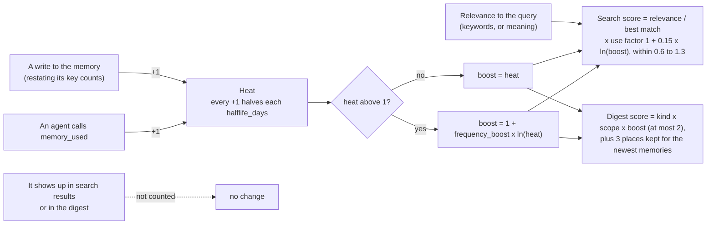

# Getting started

## Install, once

```sh
curl -fsSL https://github.com/shockalotti/membraid/releases/latest/download/install.sh | sh
membraid install
```

Or, with Go 1.27 or newer: `go install github.com/shockalotti/membraid/cmd/membraid@latest`.
Keep it current with `membraid update`; running harnesses pick up a new version
when they restart.

Run it once per machine, ever. Not per project.

`install` asks which of your harnesses to set up, with the ones it finds on this
machine already ticked, shows exactly what it will change, then does it:

| Harness | MCP server | Session digest | Agent skill |
|---|---|---|---|
| Claude Code | `~/.claude.json` | `SessionStart` hook | `~/.claude/skills/membraid` |
| OpenCode | `opencode.json` | plugin | shares the Claude copy |
| Codex | `codex mcp add` | `SessionStart` hook in `~/.codex/hooks.json` | `~/.agents/skills/membraid` |
| Copilot CLI | `~/.copilot/mcp-config.json` | `sessionStart` hook in `~/.copilot/hooks/membraid.json` | shares the `~/.agents` copy |
| Crush | `~/.config/crush/crush.json` | in the MCP server instructions | shares the Claude copy |
| Cursor CLI | `~/.cursor/mcp.json` | `sessionStart` hook in `~/.cursor/hooks.json` | shares the `~/.agents` copy |
| Gemini CLI | `gemini mcp add` | in the MCP server instructions | shares the `~/.agents` copy |
| Grok | `grok mcp add` | `grok()` function in `~/.bashrc` or `~/.zshrc` | shares the Claude copy |
| Hermes | `hermes mcp add` | plugin | `~/.hermes/skills/membraid` |
| Pi | extension (Pi has no MCP) | the same extension | shares the `~/.agents` copy |
| Omarchy bar widget | | | |
| Sync timer (systemd) | | | |

It also creates the vault at `~/.membraid/vault` if there is none. Then restart
each harness you picked, and start a **new** conversation: one opened before
membraid was installed keeps the tool list it started with.

**Hermes on a server** runs two services, and each starts its own membraid:
`hermes-gateway` (Discord, Telegram and other messaging) and `hermes-dashboard`
(the web dashboard, which is also the backend the Hermes desktop app connects
to). Restart both after upgrading membraid. Several membraid servers on one
vault at once is normal.

```sh
membraid install --dry-run                     # show the plan, change nothing
membraid install --harness claude-code,grok    # pick without being asked
membraid install --yes                         # every detected harness
```

Run it again whenever you like - after upgrading, or after moving the binary.
It changes only what is out of date, never duplicates an entry, backs up any
JSON config it edits to `<file>.membraid.bak`, and leaves every setting that is
not membraid's alone. Harness configs point at the binary's absolute path, so
harnesses that do not inherit your shell's PATH still find it.

If `membraid: command not found`, `~/go/bin` is not on your PATH:

```sh
echo 'export PATH="$PATH:$HOME/go/bin"' >> ~/.bashrc && source ~/.bashrc
```

## One vault, every project

A project is a **column value**, not a directory. Scope resolves automatically
from the git root you are standing in, so you almost never type `--scope`:

```sh
cd ~/Projects/api && membraid where
  vault   /home/you/.membraid/vault
  scope   g3f8a1c20 (api)
```

A git project's scope is its first commit (`g3f8a1c20`), so it follows the
project when you move or rename the folder, and `api` is just the readable
name. A folder with no git history gets a hash of its path (`p...`) instead.

Searches see **your project plus `shared`**. Write with `--scope shared` (or
`scope: "shared"` from an agent) for something true everywhere - a standing
preference, a rule you always want applied.

## One vault or several?

**One is the default and the recommendation.** The whole premise is coherence,
and a second vault is a second brain that does not know about the first.
Project separation already happens *inside* one vault through scope, which
covers most of why anyone reaches for a second.

Several is supported - `--vault` and `MEMBRAID_VAULT` point anywhere - and is
reasonable when the boundary is about *sharing* rather than organisation: a
work vault that syncs to a company repo, a personal one that does not.

The failure to watch for is accidental: `MEMBRAID_VAULT` set in one shell and
not another silently splits your memory in two. `membraid where` and the bar
widget both name the vault in use, which is how you notice.

## Using an existing Obsidian vault

Point membraid at a **new, empty subfolder** of your vault. It owns that
subtree and touches nothing else:

```sh
membraid init --vault "~/Documents/MyVault/Agent Memory"
export MEMBRAID_VAULT="$HOME/Documents/MyVault/Agent Memory"
```

membraid only ever writes inside its own folder. Today that folder shows
little in Obsidian: memories live in the append-only log in `.hot/`, which
Obsidian hides, so the only visible notes are `index.md` and `log.md`.
Readable concept notes, one per subject, are what distillation (slice 9) will
add. Pointing it at a vault root that already has files in it is refused,
with the subfolder command in the error.

Everything engine-owned lives in `.hot/`, which Obsidian hides: the wire log,
and the index. `.hot/.gitignore` keeps the rebuildable index out of git while
the log, which is history, stays in.

## Readable notes

Memories are lines in a log, which nobody wants to read. When agents come back
to the same subject, writing its answer a second time or from a second
session, membraid writes it up as a note you can open in any editor or in
Obsidian:

```
preferences/pkg-manager.md
projects/memory-engine/deploy-target.md
```

Each note is a `draft` holding the current answer and a History list of every
earlier answer, with when and which agent wrote it. It happens every 30
minutes on its own; `membraid distill` runs it now.

**The notes are yours to edit.** membraid rewrites a note only while it is
exactly what membraid last wrote. Once you change one (fix it, add to it, set
`status: stable`, move it to another folder), it is never overwritten again,
though new memories on the same subject are still linked to it. Your edits sync
to your other machines like everything else in the vault.

## Moving projects around

People move and rename directories constantly, so scope identity does not
depend on the path when it can avoid it.

**A git project is identified by its root commit.** Move it, rename it, clone
it again, check out a worktree - same project, same memories, nothing to do.

```sh
membraid where
  scope   g0c59d778 (memory-engine)     # g = git identity, name is just a label
```

**Anything outside git falls back to the path**, which cannot survive a move.
When that happens membraid notices and tells you, rather than quietly starting
an empty second brain:

```
membraid: this looks like a project that moved.
  You are in p24383357 (w-b), which has no memories yet.
  1 memories are filed under pb43b3cfb (w-a), whose folder is gone:
      /tmp/w-a
  To bring one across:
      membraid rescope --from pb43b3cfb
```

It never migrates on its own: two projects that merely share a name are not
the same project, and guessing there would merge unrelated memory.

```sh
membraid scopes     # every project the vault knows, and which folders are gone
```

## Sync across machines

The vault is a git repo, and membraid keeps it in step with its remote on its
own. Set the remote once:

```sh
cd ~/.membraid/vault
git remote add origin https://github.com/<you>/membraid-vault.git   # keep it PRIVATE
git push -u origin main
membraid timer install        # Linux: periodic sync via a systemd user timer
```

On the other machine, clone it and use it. There is nothing to rebuild by hand:
the first command imports the whole history from the log.

```sh
git clone https://github.com/<you>/membraid-vault.git ~/.membraid/vault
membraid status
```

**How it syncs, and why not on a fixed timer.** The thing sync exists for is
switching machines, and a 30-minute timer would cost up to 30 minutes of memory
every switch. So:

- **After writes, it pushes** once they have been quiet for `push_delay_sec`
  (60s). A burst of agent writes becomes one commit.
- **When an agent session starts, it pulls.** Starting an agent is when you most
  likely just changed machines.
- **The timer checks every 5 minutes** and syncs if there are unpushed changes
  or the last sync is older than `pull_interval_min` (15). It covers CLI writes
  and pulls while no agent is open.

**Settings** are per machine and never synced:

```sh
membraid config                          # show them
membraid config set auto_sync false      # stop syncing on its own
membraid config set pull_interval_min 5
membraid sync                            # once, now
```

**Why two machines do not conflict.** Each machine appends to its own log file
(`writes-2026-09-omarchy.jsonl`), so appends never touch the same file. If both
changed the same subject while offline - `deploy.target` on each - the newest
write wins on *both* machines and the other is kept as history. The only real
conflict is a human editing the same markdown file on two machines; sync then
stops, names the file, and leaves your local commit intact.

On Windows there is no systemd: run `membraid sync --scheduled` from Task
Scheduler every 5 minutes.

## Wiring a harness by hand

`membraid install` does this for you. For a harness it does not know, or to see
what it wrote: every harness speaks MCP over stdio, and the server is always
named `membraid` - not `memory`, which collides with Hermes's built-in memory
tool and with the memory features of Claude Code and Grok, so an agent can
write to the wrong one. `--source` records which agent wrote what, so give
each harness its own.

```json
{
  "mcpServers": {
    "membraid": {
      "command": "/home/you/go/bin/membraid",
      "args": ["mcp", "--source", "my-harness"]
    }
  }
}
```

Installs from before the rename used the name `memory`; `membraid install`
migrates those entries, and only those that run membraid.

## The bar widget (Omarchy)

Pick *Omarchy bar widget* in `membraid install`. It goes just left of the power
button, unless you have already placed it somewhere else.

A brain icon in the top right, lit when a task is open or a sync failed. Click
it for five tabs (`h` / `l` switch between them, `/` searches, `r` refreshes):

- **Overview** - sync and search status, anything worth a look (a failed sync,
  memories not yet embedded, stale tasks, a project whose folder is gone, a new
  release), and where you left off: click a task to mark it done.
- **Memories** - search (by meaning when embeddings are on) or browse by
  project and kind. *Remember something* adds your own memory, tagged as
  written by `user`. Each memory can be *corrected*, which writes the right
  statement and retires the old one into history, or *forgotten*, and opens
  its distilled note when there is one.
- **Projects** - every project membraid knows: memories, open tasks, last write
  and which agents wrote there, and its folder on this machine. Empty projects
  can be forgotten in one click. Each project lists its knowledge locations,
  with *+ Knowledge location* to add one (type the folder or *Browse*), *Open*
  and *Remove*.
- **Insights** - writes per day and per agent over the last week, and how much
  memory agents actually retrieve. An agent that never appears here is one whose
  setup may be broken.
- **Settings** - auto-sync and its timings, ranking (presets, and under
  *Advanced* the half-life, repeat-use boost and digest settings, with a live
  search that shows each result's score as you change them), search by
  meaning, sync / embed / sweep / distill now, every harness and whether
  membraid is set up in it (with *Set up*, which opens a terminal running
  `membraid install`), and the version with *Update*.

It reads `membraid ... --json` commands (`status`, `memories`, `projects`,
`insights`, `config`, `install --list`, `update --check`) and acts only by
running `membraid` commands, so everything it does can be done from a terminal.
If the panel and the CLI ever disagree, the CLI is right.

## How agents use it

Tools on their own are passive: an agent only touches memory if it thinks to.
Two things make it active, and both are set up once.

**Every session starts knowing where you left off.** A short digest - open
tasks in this project, what is known here, open tasks elsewhere - is put in
front of the model before your first message. It is a digest, not a dump:
the whole memory would bury the few things that matter.

```sh
membraid context        # see exactly what an agent starts with
```

- **Claude Code** - a `SessionStart` hook in `~/.claude/settings.json`.
- **OpenCode** - a plugin at `~/.config/opencode/plugins/membraid.js`. It uses
  `experimental.chat.system.transform`, which OpenCode marks experimental; if
  it is ever renamed the plugin goes quiet and the rest still applies.
- **Codex** - a `SessionStart` hook in `~/.codex/hooks.json`. Codex runs a new
  or changed hook only after you trust it: start Codex, run `/hooks` and trust
  membraid's. Until then sessions start without the digest.
- **Copilot CLI** - a `sessionStart` hook in `~/.copilot/hooks/membraid.json`
  that runs `membraid context --format copilot`. Copilot leaves out the
  instructions of MCP servers it has not allowlisted, so this payload carries
  membraid's instructions (when to write, keys, no secrets) with the digest.
- **Crush** - Crush has no session-start hook, but it puts each MCP server's
  instructions in the system prompt, so `install` starts the server with
  `membraid mcp --digest`, which adds the digest to those instructions. It is
  built when Crush starts the server, for the directory Crush runs in.
- **Cursor CLI** - a `sessionStart` hook in `~/.cursor/hooks.json` that runs
  `membraid context --format cursor`, since Cursor reads only JSON from a hook.
  The Cursor editor reads the same files. Cursor lists skills from both
  `~/.claude/skills` and `~/.agents/skills` without merging same-named copies,
  so where both exist `membraid` shows twice. Not yet tested in a live session.
- **Gemini CLI** - like Crush, the digest comes with the server instructions
  (`--digest`). Gemini runs user MCP servers only in folders you trust, and asks
  the first time you open one; in an untrusted folder it gets neither the tools
  nor the digest. A `SessionStart` hook was the alternative, but Gemini does not
  add its context again after `/clear`.
- **Hermes** - a plugin that adds the digest to the first turn.
- **Pi** - Pi has no MCP support by design, so `install` adds an extension at
  `~/.pi/agent/extensions/membraid.ts`. It starts `membraid mcp --digest` for
  each session, registers membraid's tools under their usual names, and appends
  the server instructions, digest included, to the system prompt.
- **Grok** - Grok discards what a `SessionStart` hook prints, so `install` adds
  a `grok` shell function to `~/.bashrc` (bash) or `~/.zshrc` (zsh) that passes
  the digest as `--rules`, which Grok appends to the session's system prompt.
  It sits between marker comments, so a rerun replaces it in place and the file
  is backed up to `.membraid.bak` first. It steps aside when you pass your own
  `--rules` or system prompt. It reaches Grok started from a terminal only; with
  another shell (fish, PowerShell) Grok gets the MCP server and skill but no
  digest.

The sources for all of these are in `assets/`, built into the binary.

The digest never breaks a session: an unusable vault produces an empty digest,
not an error.

**Every harness is told when to write.** The MCP server hands harnesses
instructions when they connect, which they place in the system prompt: write
when the user corrects you or a decision is made, key anything that can
change, record unfinished work as a task and mark it done, never store
secrets. It ships inside membraid, so there is nothing to install per harness.

**Every harness knows how to write well.** Instructions say *when*; the
membraid skill says *how* - whether something is worth remembering at all,
which kind, a key another session will reuse rather than reinvent, shared or
project scope, and how to correct a memory that turned out wrong. Harnesses
load it only when memory comes up, so it costs nothing otherwise. Source:
`assets/skill/SKILL.md`.

What none of this can do is decide *what is worth remembering* for the model. If
an agent never shows up in the widget's *Insights* after a week, the habits
need work, not the plumbing.

## The tools an agent sees

| Tool | What it does |
|---|---|
| `memory_write` | Record a fact. With a `key`, a later write on the same subject **replaces** it rather than competing |
| `memory_search` | Search current memory: this project plus `shared` |
| `memory_get` | The live answer for one subject key |
| `memory_used` | Report that memories changed what the agent did; this is what ranks useful memories higher |
| `memory_done` | Mark a task finished, by key or id, so it leaves *where you left off* |
| `memory_forget` | Retire a memory that is wrong with nothing to replace it; it stays in history |

The `key` is what makes this a shared brain rather than a pile. Claude Code
writes `deploy.target = railway`; three weeks later Grok writes
`deploy.target = fly.io`; there is **one** live answer and the old one stays in
history with the agent that wrote it.

## How memories are ranked

Search ranks by **relevance, adjusted by use**, and the digest by **kind x
scope x boost**, where boost comes from *heat*:



- **Heat** is 1 for every write to the subject and 1 for every reported use,
  each halving every `halflife_days` (30). A keyed memory's heat belongs to its
  key, so restating it keeps its history.
- **A use** is an agent calling `memory_used` because the memory changed what it
  did. Looking a memory up with `memory_get` is a retrieval, not a use. Showing up in
  results or the digest is not use: otherwise whatever surfaces most would keep
  itself on top.
- **Boost** is the heat up to one use, then grows slowly, so a memory relied on
  again and again rises without beating a clearly more relevant one. A memory
  nobody has used ranks by its own write fading, as it always did.
- **See the numbers** for any search with `membraid search QUERY --explain`, and
  for the digest with `membraid context --explain`.

Heat is counted on each machine and travels with sync, and the ranking
settings (`halflife_days`, `frequency_boost`, `digest_items`,
`digest_shared_weight`) follow you, not the machine: `membraid config set`
stores them in the vault, so every machine ranks alike. The widget's Settings
tab has presets and, under *Advanced*, a live search that shows each result's
score as you change them.

## Knowledge locations

membraid does not index documents. It records **where** knowledge lives, and
who can reach it, so agents read it there with their own tools:

```sh
membraid source add ~/Notes/design --about "Design notes; read before UI work"
membraid source add ~/Projects/api/docs --about "API specs; read before changing endpoints"
membraid source add https://docs.example.com --about "Public product docs"
membraid source add https://www.notion.so/Team-Runbook --about "Team runbook"
membraid source list
membraid source remove notes.design     # by key: source.notes.design
```

The input decides the type:

| Type | From | Who can reach it |
|---|---|---|
| **Folder** | a local path | only the machine it was added on |
| **Git repo** | a repo address (`git@...`, `github.com/owner/repo`, `...git`), or a folder inside a repo with a remote | any machine, in a checkout or by cloning; a private repo needs access |
| **Web page** | any other `http(s)` address | anyone, unless it needs a login (`--login`) or is on your private network |

- **A folder inside a git repo is saved as the repo.** `~/Projects/api/docs`
  becomes the repo's remote plus the `docs/` folder and where it is checked
  out, so your other machines can find the same knowledge by cloning it.
- **Private addresses are recognised from the address alone:** `localhost`, a
  bare machine name, `*.ts.net`, `*.local`, and private or Tailscale IP ranges.
- **Notion and Google Drive links are recognised** and marked as needing that
  service's access; published `notion.site` pages count as public.
- **Credentials never reach memory.** A token in a repo's remote URL is removed,
  and a page that needs a login records only that it does.
- **membraid never reads, clones, fetches or probes a location.**

Each is an ordinary memory with a `source.` key, a project value in the project
you are in (or `--scope shared`). Its text tells an agent on another machine
what to do, for example:

```
Knowledge location: Team runbook. Web page https://www.notion.so/Team-Runbook, needs Notion access:
use a Notion tool if you have one, otherwise ask the user. [source type="web" ...]
```

The `[source ...]` tail is what `membraid source list --json` and the widget
read back. Agents find locations in search and in the project's digest, and
they rank by use like any memory. Adding the same place again replaces its
entry; removing one retires it into history. The widget's Projects tab adds,
opens and removes them, and shows the detected type as you type.

Why not index them: searching documents people wrote is a different problem
from sharing what agents learn, agents can already read files, clone repos and
use Notion or Drive tools, and indexing is the surest way for secrets to end up
in memory ([V1-SCOPE](V1-SCOPE.md)).

## What an agent actually sees

**At session start**, four things reach the model:

| What | Size | Contains memories? |
|---|---|---|
| MCP server instructions: when to search, when to write, keys, no secrets | ~1,500 chars | no |
| Six tool definitions | ~4,500 chars | no |
| The membraid skill: only its description, until the agent loads it | ~375 chars (~7,800 if loaded) | no |
| The digest | under 4,000 chars | **yes** |

Claude Code and Hermes may keep MCP tools behind a tool search until the model
asks for them, so the definitions are not always in the prompt.

The digest is the only part built from memory. It holds up to 8 open tasks in
this project, the 12 highest-scoring facts (preferences, project values,
insights; `digest_items`) from this project plus `shared`, each clipped to 240
characters, and a count of open tasks per other project. Facts are scored by
kind, scope and heat (see *How memories are ranked*), not by relevance: the
digest does not know what you are about to ask. Claude Code gets it from the `SessionStart`
hook, OpenCode from its plugin (re-attached to every request, but the same text
all session), Hermes from its plugin on the first turn, Codex from its `SessionStart` hook,
Copilot and Cursor from their `sessionStart` hooks, Crush, Gemini and Pi with the MCP server
instructions, and Grok through `--rules`.

**During a conversation nothing is injected.** Memory enters the context only
when the agent calls a tool: `memory_search` returns up to 10 hits, one line
each with kind, key, content, scope, the agent that wrote it, and its id.
Whether it searches is the agent's call, guided by the instructions.

**Search is keyword full-text by default**: SQLite FTS5 with porter stemming,
common words dropped, ranked by BM25. It finds "deploy target" in a memory that
says deploy target; it will not connect "where does this app run" to "deploys
to Railway". Reusing keys is what keeps related memories findable. **With
semantic search turned on, search goes by meaning instead** (see below), and
falls back to keywords whenever the embedding model is unavailable.

**How long a memory takes to reach another machine.** A write is pushed about
60 seconds after writes go quiet. The other machine pulls when a session starts
there, when its 5-minute timer finds the last pull 15+ minutes old, and from
inside any running MCP server once that interval has passed. The digest is built
from what is already on disk while the session-start pull runs in the
background, so a memory written elsewhere a minute ago can miss a new session's
digest and still turn up in its searches.

## Semantic search (optional)

Keyword search finds memories that use the words you search with. Semantic
search finds them by meaning. On the search evaluation set, where half the
questions share no words with their answer, the right memory landed in the top
five for 47% of questions with keyword search, 96% with EmbeddingGemma, and 91%
with the model built into membraid. The full measurements and why this design
won are in [SEARCH-EVALUATION.md](SEARCH-EVALUATION.md).

**Memory text stays on your machine.** Each machine computes its own embeddings
with a local model and keeps them in its own index, never in the synced vault.
Two things do reach the network: the built-in model downloads once from Hugging
Face, and if `OLLAMA_HOST` points at another machine, memory text goes there to
be embedded. Otherwise nothing leaves.

**Turn it on** by picking *Semantic search* in `membraid install`, or by hand:

```sh
membraid config set embeddings ollama    # EmbeddingGemma through Ollama (most accurate)
membraid config set embeddings builtin   # or the model built into membraid, no Ollama needed
membraid embed                           # embed the memories you already have
```

- **ollama** uses `embeddinggemma:300m-qat-q4_0` (239 MB; `ollama pull` it
  first) unless `embed_model` names another. An idle Ollama server uses about
  60 MB; the model loads when membraid asks for it and unloads after 5 idle
  minutes.
- **builtin** uses all-MiniLM-L6-v2, downloaded once (about 90 MB) to your user
  cache directory under `membraid/models`. Slightly less accurate, and nothing
  else to install.

New memories are embedded in the background by running MCP servers and by the
sync timer; `membraid status` shows how many are covered. If Ollama is not
running when a search happens, that search uses keywords rather than failing.
Changing model re-embeds on the next `membraid embed`.

## Use it from anything else

Scripts, cron, a harness nobody has written yet:

```sh
membraid write "deploy target is railway" --key deploy.target --kind project_param
membraid search "deploy"             # results show each memory's id
membraid get deploy.target
membraid history deploy.target
membraid done task.auth.fix          # finish a task, or: done --id ID
membraid forget --id ID              # retire a memory with nothing true to replace it
```

## Read it without any of this

That is the point. Every memory is a line of plain JSON in the vault's
`.hot/writes-<month>-<host>.jsonl` files, and the vault is a git repo:

```sh
cd ~/.membraid/vault
grep -i "deploy" .hot/writes-*.jsonl
git log -p .hot/                     # who learned what, and when
```

The files are append-only history, so fix memory through `write` (same key) or
`forget` rather than by editing lines: a hand-edited line would not match what
other machines already imported. Markdown notes you drop in the vault are read
by `membraid ls` and `cat`; distillation (in progress) is where memories will
become markdown concept files.

Nothing here needs tending. Tending it just makes it better.
