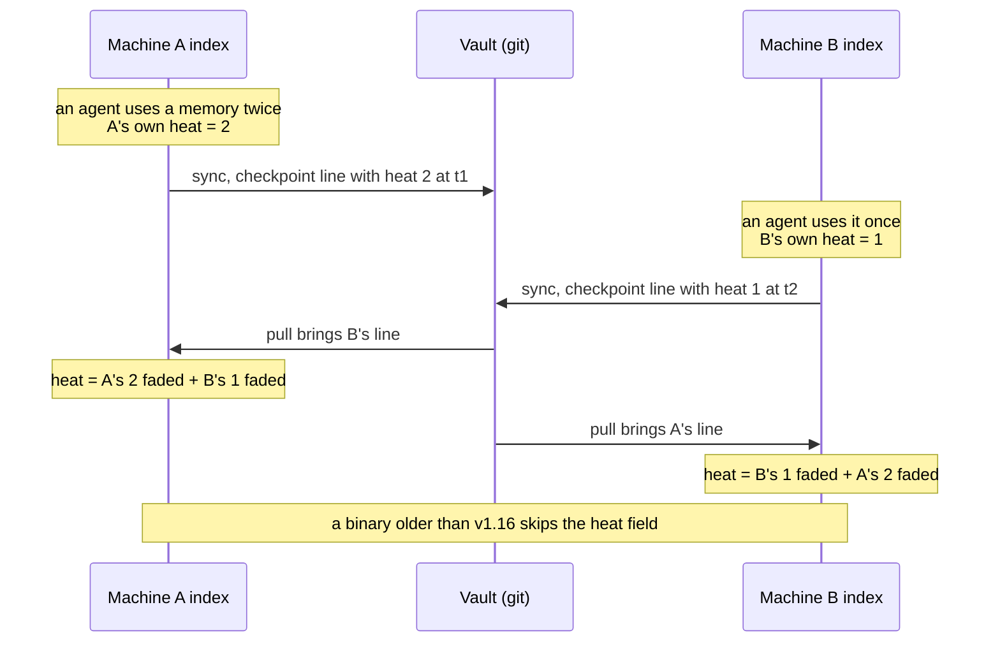

# Memory Engine - Design Spec v1.14.1

**Status:** working spec - **review loop closed; implementation begun**
**Date:** 2026-09-12
**Close-out (not a review round):** both reviewers concurred that prose review
had reached diminishing returns and that M0 should begin. One item was locked
first, because it is the single change that is expensive after data exists:
§5.3 now carries the *writer-side* half of wire-log versioning - when `v` must
be bumped, that parsers for every emitted `v` are kept forever, that the log is
the only non-rebuildable artifact with the `checkpoint` line as its sharpest
edge, and that the stamp stays per line rather than per file. Everything before
this line is the product of review rounds 3-14.
**Recent:** v1.14 folds in review round 14 (R13's fifty-seven findings
re-verified closed, three new). Four rounds hardened `last_retrieved` across
the *rebuild* path and left the two refresh paths that run far more often
uncovered - including the watcher pass that fires on the human edit promoting a
draft to stable - so §5.2 now states the rule for all three: frontmatter fields
are replaced, machine columns are preserved. v1.13 made the captured wire log
authoritative and dropped the vault's embedded copy as a fallback, which makes
a capture that races an append unrecoverable; `backup` now captures whole lines
only and §5.3 distinguishes a truncated final line (skip, the write never
completed) from an unknown `v` (refuse, a complete record this binary cannot
read). And the acceptance-row lag that rounds 6 and 13 each fixed one instance
of is closed as a class: §16 now says acceptance rows restate the body, never
extend it, and the section wins on conflict.

> **Read `V1-SCOPE.md` first.** This document is the *design reference*: complete,
> reviewed, and correct about things v1 will not build for months. `V1-SCOPE.md`
> says what is actually being built, in what order, and what is deferred. Where
> the two disagree about *scope*, V1-SCOPE wins; where they disagree about *how a
> mechanism works*, this document wins.

A standalone, framework-agnostic durable memory system. Plain markdown vault
(source of truth, human-maintainable) + a hot SQLite index (fast working set).
Served to any agent over MCP or REST. Local-first by default, hostable remotely.

**Design premise (corrected after the review loop closed):** the sections below
describe a human who curates - reading drafts, promoting them to `stable`,
reading sweep reports. **Most people will never do that.** The engine is
therefore designed so that everything load-bearing happens without them:
supersession, decay, distillation and sweep all run unattended, and curating
nothing leaves a store that is still consolidated, still decaying, and still
greppable. Promotion is an affordance, never a prerequisite. Any rule below that
reads as though curation is required is describing the 2% case.

---

## 1. Principles

> *Not more context - cleaner context.*

1. **The engine is not owned by any agent framework.** It is a standalone
   service. Claude Code, OpenCode, Codex, Grok, and (later) DSH are consumers
   that connect to it. Nothing in the engine names any of them.
   *(v1.17: the engine core - index, wire log, vault, retrieval - still names
   none. The binary also ships the adapters: `membraid install` writes each
   harness's config, `context --format` has claude, copilot and cursor payloads,
   and `mcp --digest` carries the digest in server instructions for harnesses
   with no other way in. They live at the edge, in `cmd/membraid` and
   `internal/install`, so one `go install` delivers everything; see V1-SCOPE.)*
2. **Maintainability beats correctness.** Every field, tool, and lifecycle
   rule must survive the question: "will I still maintain this in six months,
   at 2am, when something misbehaves?" If the answer is no, it is debt.
   A perfect system nobody maintains is worthless.
3. **Cold is for humans, hot is for machines.** The cold vault is markdown a
   human can read, edit, and reason about in Obsidian or any text editor. The
   hot index carries the machine-precision bookkeeping (timestamps, supersession
   chains, confidence, retrieval counts).
4. **Trust is derived, never self-asserted.** The tool surface never lets an
   agent mark its own work as verified or promote its own draft. This is an
   assumption about the tool surface, not a hard guarantee: clients with file
   write access (e.g. Claude Code `Write`) can edit vault files directly. The
   design treats promotion as a human curation norm, not something that can be
   enforced against a hostile writer.
5. **Facts supersede; history is never overwritten.** Supersession chains in
   the hot index, deprecation in the cold vault, git + log.md as the audit
   trail.
6. **Staleness is acted on, not just tracked.** A sweep job archives, decays,
   and surfaces stale context. Lifecycle features pay for themselves through
   preventive maintenance.
7. **Zero heavy machinery.** No attestation subsystem, no conformance checker,
   no schema registry, no source-credibility scoring. If you can `cat` a file,
   you can read the vault; if you can `git clone` a repo, you can ship it.
8. **One writer.** *(v1.17: v1 has no daemon. Several processes - each
   harness's MCP server, the CLI, the timer - write one vault at once, held
   together by SQLite's write lock, one wire-log file per machine and a lock
   around git sync, and tested under load; see V1-SCOPE, "Concurrency is real".)*
   The engine is a single long-running process. Everything else
   is a client.

---

## 2. Scope

**In scope:**

- The `membraid` Go binary: a **daemon** (engine core, hot index, cold
  vault, wire log, retrieval, distillation, sweep, MCP server, REST API) plus a
  thin **stdio shim** used as the MCP entry point. *(v1 ships a single process
  with neither daemon nor shim; see `V1-SCOPE.md`.)*
- MCP adapter (the primary tool surface - one server, many agent clients).
- Deployment: local sidecar (daemon + stdio shim) and remote (Streamable HTTP
  MCP + REST).

**Out of scope (for now):**

- Vector search (keyword FTS5 first; vectors are a later milestone).
- Attested computations, source-credibility scoring, conformance tooling.
- Any agent-specific integration baked into the engine (adapters are thin and
  separate). *(v1.17: the adapters ship in the same binary; see principle 1.)*
  **Context injection into a client's turn is adapter work**, not
  engine work: MCP has no "pre-step hook", so adapters (e.g. a Claude Code
  `UserPromptSubmit` hook, an opencode hook) call `memory_search` and splice
  the result into the prompt. The engine only exposes search.

**Adapter priority:** Claude Code, then Codex, then OpenCode - the clients most
developers actually drive. Everything else (Grok, DSH, a web UI, team
deployments) is one more consumer of the same surface and gets no special
treatment in this design. Earlier drafts named DSH as a first-class target; it
is not.

---

## 3. Architecture

### 3.1 Daemon plus stdio shim (single-writer)

> **Deferred past v1.** v1 is one process with one client; there is no second
> writer to race. Build this when a second concurrent client exists.


Each stdio MCP client spawns its own copy of the server binary. If that binary
*is* the engine, two open clients means two engines: two processes writing one
SQLite file and appending to the same wire log, both running `git commit` in the
same repo. Git collides on `index.lock` within seconds. Derived supersession, a
read-modify-write, races across processes. This is a whole bug class.

The stdio entry point is therefore **not** the engine. It is a thin shim that:

1. Checks for a running daemon on the unix socket `~/.membraid/engine.sock`;
2. Spawns the daemon if it is not up;
3. Proxies stdio <-> unix socket.

Result: one engine process, one SQLite writer, one git committer, one scope
resolver. The shim naturally carries its own cwd as the scope hint (§17). The
shim is ~100 lines and deletes an entire class of bug. It was decided in v1.2,
before M1, so no write path needs cross-process locking.

**Daemon lifecycle (failure modes specified):**

- **Spawn race.** Two shims start together, both find no socket, both attempt
  to spawn a daemon. The daemon takes an **exclusive flock** on
  `~/.membraid/daemon.lock` before binding the socket; the loser retries
  connecting in a short loop (100ms, 5 retries), by which time the winner is
  bound.
- **Stale socket after a crash.** The socket file exists but connect returns
  `ECONNREFUSED`. The daemon unbinds and rebinds, gated on holding the flock.
- **Spawned daemon refuses to start.** The spawn race presupposes a daemon that
  binds within the retry window, but the design also has *startup refusals*
  with no bind at all: a downgraded binary refusing a newer schema (§5.3) and
  config errors that exit the daemon before it binds. On spawn the shim waits
  for either its endpoint to come up - the socket, or the verified port file on
  Windows - or the daemon's exit; on exit without binding it
  surfaces the daemon's status once (e.g. "refused to open index: schema newer
  than this binary") and fails the connection instead of exhausting the retry
  loop into silence. A daemon that will not start must look like a refusal with
  a reason, not like a hang - a hang is indistinguishable from the whole bug
  class this section exists to kill. The shim never unlinks a socket itself;
  that is the daemon's job under the flock.
- **Windows.** `AF_UNIX` exists on Windows 10+ but Go's support is uneven and
  file-permission semantics differ. **The named fallback is loopback TCP** with
  a port file (`~/.membraid/engine.port`) and a random bearer token
  (`~/.membraid/engine.token`); the shim reads both and connects over TCP.
  The failure modes in this section are **not simply "identical"** here, and
  saying they are is what hides the one difference that matters: a unix socket
  path cannot be taken over by an unrelated program, but **a TCP port can be
  recycled**. After a crash the port named in a stale port file may belong to
  something else entirely, and a shim that connects and sends its hello frame
  would hand `engine.token` to an arbitrary local process - turning a stale-
  endpoint nuisance into a credential disclosure. So on this path: the port
  file carries the daemon's **pid and a nonce** alongside the port; the
  **daemon speaks first** on accept, echoing the nonce with its
  `protocol_version`; and the shim sends nothing - token included - until that
  echo matches. A port file whose pid is dead, whose listener stays silent, or
  whose echo is wrong is treated exactly like a stale socket: respawn under the
  flock and rewrite it. Everything else here (flock, refusal-with-reason,
  version skew, the handshake) applies unchanged.
- **Idle behaviour.** The daemon stays resident after the last shim disconnects
  (scheduled sweep/distill timers still run). An `idle_timeout` (default `0` =
  never) shuts it down when nothing is connected; the shim re-spawns on demand.
  "While a consumer session is live" (§8) therefore means "at least one shim is
  connected."
- **Connection handshake.** `--source` is a shim *launch* flag and the shim
  mints the `session_ref` (§10), but the daemon is what stamps rows, so both
  have to cross the socket. On connect the shim sends one hello frame -
  `{protocol_version, source, session_ref, scope_hint}` - and the daemon binds
  it to that connection for its lifetime. Every write on the connection is
  stamped from the handshake, never from a per-call argument. `scope_hint` is
  the shim's own resolution of steps 2 then 3 of the §17 ladder (the
  `--scope`/`MEMBRAID_SCOPE` pin, falling back to the cwd slug); the daemon then
  applies step 1, the hint, step 4 (its own configured default), and step 5
  (`unscoped`), in that order - the ladder exactly as §17 numbers it, which
  since v1.8 is also the order it is executed in. The Windows loopback path
  carries the **same frame** but not the same opening move: there the daemon
  speaks first with its nonce echo (see the Windows bullet above), and only
  once that verifies does the shim authenticate with `~/.membraid/engine.token`
  and send this hello frame.
- **Version skew across an upgrade.** `idle_timeout` defaults to `0`, so the
  daemon is *designed* to outlive every client - including the binary upgrade
  that replaces it on disk. A new shim meeting a months-old resident daemon is
  therefore the normal upgrade path, not an edge case, and it is the one
  moment when "one writer" can be two versions of itself. The hello frame's
  `protocol_version` exists for exactly this: on mismatch the daemon answers
  with its own version and refuses the connection; the shim, which knows it
  was launched from the newer binary, sends a shutdown request, waits for the
  flock to clear, and spawns the daemon afresh. The old daemon exits cleanly
  (committing the wire log, §3.3), so the handover costs one reconnect and
  loses nothing. Negotiating a shared protocol in-place would be the heavier
  answer and buys nothing here: in every supported deployment both processes
  are the same binary, so the only correct resolution is for the newer one to
  win.
- **One writer means one writer inside the process too.** §13 puts MCP
  handling, the REST server, the distill timer, the sweep timer, the hourly
  wire-log commit (§3.3) and, from M9, the vault watcher in concurrent
  goroutines of a single daemon. Four of those mutate the vault and run `git`.
  "One git committer" was only ever a claim about the *process*; nothing made
  it true of the goroutines inside it, and `git index.lock` collides between
  goroutines exactly as it does between processes - the bug class this whole
  section exists to kill, one level down. Nor is it a rare interleaving:
  `sweep_every` (168h) is an exact multiple of `distill_every` (30m), so every
  sweep fires on an instant a distill is also due, and both now cover the full
  index (§17). Therefore **all vault-mutating and git-running work is
  serialized through one maintenance lock**, held for the duration of a job.
  Distill, sweep, the wire-log commit and the watcher's re-index acquire it; a
  scheduled job that finds it held **skips its tick and logs**, rather than
  queueing, because a distill that runs half an hour late is worth nothing
  over one that just ran. Read paths - search, get, stats - never take it.
  This is one mutex, not a job framework (principle 7).
- **Trust boundary of the socket.** Any local process that can open the socket
  can claim any `source`. That is acceptable and deliberate: the socket lives
  in the user's home directory at mode 0600, and a process that can open it
  already holds the user's filesystem rights, so there is nothing further to
  protect. `source` is attribution, not authentication - said plainly here so
  that no security decision gets built on it later.

```
  Claude Code ──(stdio)──▶ shim ─┐
  OpenCode    ──(stdio)──▶ shim ─┤  unix socket  ┌─────────────────────────────┐
  Codex       ──(stdio)──▶ shim ─┼──────────────▶│        engine daemon         │
  Grok        ──(stdio)──▶ shim ─┘                │  MCP over Streamable HTTP    │
                                                  │  REST API (remote)          │
                                                  │  SQLite hot index (1 writer)│
                                                  │  vault git (1 committer)    │
                                                  │  sweep / distill timers     │
                                                  └─────────────────────────────┘
```

Remote mode runs the daemon alone (no shim); clients talk MCP/REST over the
network.

### 3.2 Storages

| | Hot index | Cold vault |
|---|---|---|
| Role | Working set, fast retrieval | Durable truth, human curation |
| Tech | SQLite + FTS5 | Markdown + YAML frontmatter |
| Location | `~/.membraid/index.db` | `~/.membraid/vault/` (git) |
| Precision | Machine timestamps, confidence, chains | Human-readable dates |
| Owner | Engine (machine) | Human (curated) |

### 3.3 Durability story (what "rebuildable" means)

The hot index is **primary storage for the EVOLVING class of data**, not a pure
cache: an EVOLVING fact exists only in SQLite until distillation qualifies it
and a human promotes it. Deleting `index.db` must not lose that class
permanently. Therefore:

- Every `memory_write` appends one JSONL line to
  `vault/.hot/writes-YYYY-MM.jsonl` (inside the vault git repo). Cheap,
  greppable, survives a corrupt DB, preserves "one `git clone` ships
  everything."
- **The log is written before the index, and the order is load-bearing.** A
  write appends and flushes its wire-log line **first**, then commits the
  SQLite transaction. A crash between the two leaves a logged line with no row,
  which the next replay heals. The reverse order leaves a row with no line -
  and §5.3 made "rebuild by `reindex`" the routine upgrade path, so that row
  survives only until the next upgrade and then vanishes, weeks after the crash
  that orphaned it and with nothing left to explain it. Log-first keeps the log
  a **superset** of the index, which is the invariant every other durability
  claim here rests on. Same species of rule as close-before-insert (§6.2): one
  sentence to state, silent for months to get wrong.
- **The wire log is committed to git**: on a timer (default hourly), on clean
  shutdown, and opportunistically alongside every vault mutation. It does not
  sit uncommitted indefinitely. That commit runs under the maintenance lock
  (§3.1), like every other git-running job.
- **The wire log is never pruned.** Deleting old months would break replay's
  linear history. Growth is deliberately bounded in practice (~7MB/year at 100
  writes/day); this is a design decision, not an accident waiting to be
  "fixed."
- `membraid reindex` rebuilds the whole hot index by replaying the wire
  log faithfully (§3.4), then re-mirroring vault concepts. This is the escape
  hatch for every divergence bug. Reindex is a second writer, so it takes the
  **same exclusive flock** on `~/.membraid/daemon.lock` that the daemon holds
  from spawn until exit - **non-blocking**: if the flock is held, a resident
  daemon owns the index and `reindex` refuses with a clear message ("stop the
  daemon, reindex, start it again") rather than racing it on git
  `index.lock`. The upgrade path never trips this: there the old daemon shuts
  down before the new one's open-time rebuild (§5.3), so no manual stop is
  involved.
- SQLite runs in WAL mode. `membraid backup` produces a consistent copy of
  index + vault + wire log - and consistency across three artifacts a live
  daemon is writing does not come free. A plain file copy of `index.db` under
  WAL is **torn**: committed frames live in the `-wal` sidecar until a
  checkpoint, so the copy is a database missing its most recent commits. The
  vault and the log also move under a copy that takes any time at all. So
  `backup` uses SQLite's **online backup API** for the index (never `cp`),
  snapshots the vault at a **fixed git commit** rather than reading the
  working tree, and captures the three in a fixed order: **index first, wire
  log second, vault last.** That order is the backup-side face of
  log-before-index above. A log captured *after* the index is a superset of
  it, so replay from the backup heals whatever landed in between; the reverse
  captures rows whose lines are missing, and a restore drops them silently at
  the first rebuild - the exact failure log-before-index exists to prevent,
  re-entering through the tool meant to recover from it. The captured log is
  also the *authoritative* log: it lives inside the vault (`vault/.hot`, §3.2),
  and the vault snapshot is a fixed commit, so its embedded `.hot` is strictly
  older than the separately captured log. A restore therefore replaces the
  restored vault's embedded `.hot` with the captured log, never appends to it.
  The log is captured the way it is written: **whole lines only.** Each
  wire-log append is a single write of one newline-terminated line - stated
  here because the capture rule depends on it - so a reader never sees
  interleaved bytes, but a copy that races an append can still end mid-line.
  `backup` therefore captures up to the last complete newline-terminated line
  and discards a partial tail. Nothing is lost with it: by log-before-index
  above, a line whose write had not completed cannot correspond to a committed
  row in the index copy either. This mattered less when the vault's embedded
  `.hot` was a second copy to fall back on; now that the captured log is
  authoritative and replaces it, a torn capture has nothing behind it.
  `backup` takes no flock, because it writes nothing; it is the one read path
  whose correctness depends on an ordering rule.
- **Every CLI subcommand that touches the artifacts states its stance on a
  resident daemon.** `reindex` refuses while the flock is held (above);
  `backup` runs safely alongside a live daemon under the rules just given;
  `init` **refuses** when `vault_path` or `index_path` already exists, rather
  than re-initializing underneath a running writer. Gating one subcommand and
  leaving its neighbours unstated is how a guarded escape hatch grows an
  unguarded back door.

### 3.4 Wire-log line format (faithful replay)

Replay must **restore** state, not recompute it. Recomputing supersession under
a changed threshold would produce a different graph than the one that existed.
So each line records the derived outcome, not just the input. Three line types:

```json
{"v":1,"t":"write","ts":"2026-09-12T10:00:00Z","id":"<uuid>",
 "key":"editor.theme","scope":"mem-a3f7b2c1","source":"claude-code",
 "kind":"preference","content":"prefers dark theme",
 "confidence":0.7,"session_ref":"s-123",
 "supersede_mode":"key","superseded":[{"id":"<prior-uuid>","key":"editor.theme"}]}
```

```json
{"v":1,"t":"write","ts":"2026-09-12T10:05:00Z","id":"<uuid>",
 "key":null,"scope":"mem-a3f7b2c1","source":"opencode",
 "kind":"insight","content":"the deploy target is railway",
 "confidence":0.6,"session_ref":"s-124",
 "supersede_mode":"fuzzy","superseded":[{"id":"<prior-uuid>","matchScore":0.94}]}
```

- `t: "write"` - a memory write. `supersede_mode` is `key`, `fuzzy`, `explicit`
  or `null`, so the log is self-describing and M4's threshold tuning can filter
  on it. `superseded` is **always an array**, empty when nothing was closed: a
  keyed write closes *every* matching current row (§6.2). A keyed entry carries
  the matching key, a fuzzy entry the `matchScore` that fired. Replay uses these
  fields directly instead of re-deriving.
- Replay sets **both** supersession pointers from the `superseded` array: every
  listed id gets `superseded_by` = this row's id, and this row's `supersedes`
  becomes the most recent of them (§6.2). The array is the authoritative record
  of a multi-close; neither column alone can hold one.
- `t: "distill"` - a distillation outcome, so `source_concept` links survive a
  rebuild:
  `{"v":1,"t":"distill","ts":...,"rows":["<uuid>",...],"concept":"facts/foo.md"}`.
  Without this, reindex drops `source_concept`, resurrecting duplicate
  proposals and marking every distilled row as a stale candidate. The wire log
  records the outcome of *every* derivation, not just supersession.
  Distillation is a **two-destination write** - the concept file into the
  vault, and this line into the log - and the order is **file first, line
  second**. A crash in between leaves an unlinked concept file, which the next
  pass **adopts**: its de-dupe check (§8 step 5) finds the ground already
  covered, links `related`, and writes the `distill` line the crash lost, so
  the rows regain `source_concept` instead of staying unlinked forever. The
  mirror re-discovers the file from the vault on any rebuild. The reverse order leaves `source_concept`
  links pointing at a path the mirror does not contain after a rebuild. Same
  species of rule as log-before-index above: one sentence to state, silent for
  months to get wrong.

```json
{"v":1,"t":"checkpoint","ts":"2026-09-12T12:00:00Z",
 "rows":[{"id":"<uuid>","last_retrieved":"..."}],
 "concepts":[{"path":"rules/foo.md","scope":"shared","type":"rule",
               "key":"memory.history","last_retrieved":"..."}]}
```

- `t: "checkpoint"` - decay state, written by each sweep. A checkpoint line is
  a **full snapshot** and supersedes all prior checkpoints on replay; replay
  never merges them. It refreshes `last_retrieved` so a rebuilt index does not
  look never-retrieved - for **both tables**: it addresses `memories` by row
  id and the `concepts` mirror by path. The concepts half is the one an
  implementer would skip: `reindex` re-mirrors concepts wholesale from the
  vault (§5.2), so a rebuild naive about retrieval state resets every concept
  to never-used. Since §5.3 made a rebuild the ordinary upgrade path, that is
  the curated tier tanking its decay for the weeks that follow - and the
  guarantee above would silently hold for hot rows only.
  The concepts entry carries **`scope` and `key` as well as `path`**, because
  `path` is the one attribute this design actively invites a human to change:
  §4.1 says folders carry human organization and a person navigates the vault
  by folder, so moving `rules/foo.md` into `decisions/` is ordinary curation
  rather than an edge case, and a path-only restore would quietly reset the
  decay of every concept anyone reorganized. Restore matches `path` first and
  falls back to the mirror's **full identity axis**, `(scope, type, key)` -
  all three ride in the entry. `scope` has to be there, not paired with the
  key from context, because keys are scoped subjects: two scopes can both hold
  `editor.theme`, and the fallback must also survive the scope-generalizing
  edit (§4.3) that promotes a concept to `shared` - a move that changes both
  attributes a path-only or key-only restore keys on. `type` has to be there
  because without it the fallback is **not unique**: §5.2 indexes concepts on
  `(scope, type, key)` and §6.2 de-dupes on it, so one scope may legitimately
  hold a `preference` and a `rule` under the same key, and a `(scope, key)`
  fallback would have to choose between them. Carrying `type` costs nothing -
  the curation this fallback exists to survive changes path and scope, never
  type. Should the fallback still match more than one row (possible only if
  the mirror already violates that identity), restore **skips the entry**
  rather than guessing: writing one concept's decay onto another's is worse
  than the reset it was avoiding. A
  keyless concept renamed outside the engine does lose its retrieval state:
  bounded, visible, and exactly why `key` is worth carrying for the concepts
  that have one. Sweep's own archival moves need no special handling - the
  checkpoint is written after the run, so it records post-archive paths, and
  archived concepts are out of retrieval anyway.
- Hot rows are **never deleted** anywhere in the lifecycle; they are superseded,
  decayed, and suppressed. This is explicit: decay and archival, never
  destructive removal from the index.

---

> **Implementation note (v1, sync).** Two additions made while building sync,
> both consistent with the writer-side rules in §5.3:
>
> - **One log file per machine**: `writes-YYYY-MM-<host>.jsonl`. Git is the sync
>   protocol, and two machines appending to one shared file is a merge conflict
>   whenever both write between syncs. File naming is not line format; older
>   `writes-YYYY-MM.jsonl` files are still read. Readers order lines by parsed
>   timestamp across all files, never by file or by string comparison.
> - **Two new line types at `v:1`**: `close` (a task finished with no successor)
>   and `rescope` (a scope's memories moved). Neither changes an existing type; a
>   binary that predates them refuses them as unknown rather than misreading
>   them. `rescope` is logged because a rescope applied only to the local index
>   is undone on every other machine by replay.
>
> Cross-machine merge rule: on a keyed subject the newest write (by timestamp,
> ties by id) is live and every older one is closed, whichever order the lines
> arrive in - so machines converge instead of diverging.
>
> **Implementation note (v1.18, import order).** Every index must equal a
> rebuild from the whole log, whatever order lines arrived in. Three changes make
> that hold:
>
> - **A rescope leaves an alias.** The old scope id resolves to the new one, so a
>   write that still names it (a checkout that has not noticed the move) lands
>   with the project, and reads from the old id find it. A later rescope into the
>   old id brings it back into use.
> - **Out-of-order rescopes replay the log.** A rescope older than changes
>   already applied to either scope, or a write or close older than a rescope
>   already applied to its scope, would give a different result applied late.
>   Import detects both and replays the whole log in order, keeping what the log
>   does not hold (embeddings, heat, uncheckpointed retrievals). An index from
>   before schema 5 replays once on upgrade.
> - **Lines naming a memory not here yet are kept.** A close, note link or
>   checkpoint row for an id the index lacks is applied when the write arrives,
>   including in a rebuild, where a machine with a slow clock can stamp a close
>   before the write it closes.
>
> Import also fingerprints the bytes before each saved position, so a hand edit
> that shortens an earlier line makes it reread the file instead of resuming
> mid-line. Checkpoint lines gain an optional `scopes` array (project id, name,
> first and last seen, and the writing machine's own path), so a rebuilt index
> keeps the project registry; a machine's per-day use counts replay as the
> largest seen rather than the first.
>
> **Implementation note (v1.15.1, retrieval state).** Checkpoint lines are
> written by sync as well as sweep: at most once an hour, only when something
> was retrieved since the last one, and carrying only rows that have a
> `last_retrieved`. With one log per machine, replay cannot let the latest
> snapshot replace the others, because one machine's snapshot would erase
> another's retrievals. Replay keeps the newest `last_retrieved` per row across
> every checkpoint instead. The line format is unchanged. Only intentional reads
> record retrieval (search results returned to a caller, key and id lookups);
> the session digest, status and maintenance reads never do (§7.2).

> **Implementation note (v1.16, use heat).** Checkpoint lines also carry two
> optional arrays: `heat`, this machine's use heat per subject with the time it
> was last updated (`{"scope","kind","key"}` or `{"id"}`, `"heat"`, `"at"`), and
> `uses`, its use counts per agent per UTC day for two weeks. They are added in
> place, without a new `t` or `v`, because readers refuse unknown types and
> versions but skip unknown fields: an older binary keeps syncing and ranks as it
> did. A reader keeps the newest value per machine and per subject, and sums
> across machines at ranking time. Heat fades in proportion, so each machine's
> value faded to now adds up exactly, and no use is counted twice.



## 4. Cold Vault (source of truth)

### 4.1 Layout - folders for humans, `type` for routing

```
<vault>/
  index.md              # optional map / README of the vault
  log.md                # human-change digest, newest-first (see §4.5)
  facts/                # type: fact
  rules/                # type: rule
  decisions/            # type: decision
  procedures/           # type: procedure
  preferences/          # type: preference
  people/               # type: person
  projects/             # type: project
  archive/              # swept/stale items, excluded from retrieval
  .hot/                 # wire log: writes-YYYY-MM.jsonl (engine-owned)
```

- **Folders carry human organization.** A person browsing Obsidian navigates
  by folder; nothing is enforced by it.
- **`type`** stays in frontmatter as a routing hint for agents. It is advisory,
  never load-bearing for file location.
- **Filenames are human-meaningful slugs.** No timestamp prefixes. When an
  agent proposes a concept the engine checks for an existing filename first and
  de-dupes; near-collisions are disambiguated by git, not invented suffixes.

### 4.2 Concept file format

```markdown
---
type: rule
title: Never overwrite memory history
summary: Facts supersede; deprecated concepts are never rewritten in place.
status: stable
scope: shared            # workspace slug, or `shared` for cross-project (§17)
key: memory.history      # optional subject key; makes de-dupe exact (§6.2)
author: coder agent      # <agent-name> agent, or the human's name
created: 2026-09-01
updated: 2026-09-11
tags: [memory, lifecycle]
related: []              # optional slugs/links to related concepts
sources: []              # optional: where this came from (URL, session ref)
stale_after:             # optional absolute date (YYYY-MM-DD) when this decays
---
The markdown body. Plain prose. Links to other concepts use normal markdown
links or Obsidian [[wikilinks]].
```

### 4.3 Field rules

| Field | Required | Notes |
|---|---|---|
| `type` | yes | Small vocabulary: fact, rule, decision, procedure, preference, person, project. |
| `title` | yes | Short, human-readable. |
| `summary` | no | One-sentence description; cheap to read without opening the body. |
| `status` | no (default `stable`) | `draft` / `stable` / `deprecated` / `archived`. |
| `scope` | no (default `shared`) | Workspace slug or `shared`. Editing this is how a human generalizes project knowledge to cross-project (§17). |
| `key` | no | Subject key (`editor.theme`), carried from the distilled cluster. Makes vault de-dupe and near-duplicate detection exact instead of fuzzy (§6.2, §9). |
| `author` | no | Who wrote it: `<agent> agent` or a human name. Informational. |
| `created` | yes | `YYYY-MM-DD`. |
| `updated` | no | `YYYY-MM-DD`, when a human edits. |
| `tags` | no | Loose tags. |
| `sources` | no | Simple refs: URLs, session IDs, file paths. No scoring. |
| `related` | no | Link slugs; the seed of a graph. |
| `stale_after` | no | Absolute `YYYY-MM-DD`. Sweep acts on this. |

**Explicitly cut from OKF leftovers:** `generated: {by, at}` nesting (replaced
by flat `created`/`author`), `verified` lists, per-source credibility signals,
attested computations, `okf_version` headers, conformance rules, reserved
filename constraints beyond `index.md`/`log.md`.

### 4.4 Verification is implicit, not a field

There is **no `verified` field.** The trust model:

- **A human editing a `draft` note in Obsidian is the review.** The edit that
  promotes `draft` to `stable` is a human act (agents never promote their own
  drafts). `log.md` records the timestamp.
- **The vault only ever contains what a human has seen and kept.** Anything
  uncurated lives in the hot index or as `status: draft`.
- Trust tiers are inferred, not stored:

| Tier | Meaning |
|---|---|
| `stable` | Present in the vault, human-reviewed (explicit or by adoption). |
| `draft` | Agent-proposed, awaiting human curation. Retrievable but rank-penalized (§7.2). |
| `deprecated` | Superseded or obsolete; excluded from retrieval. |
| `archived` | Moved to `archive/` by sweep; excluded from retrieval, recoverable. |
| `hot` | Working state only; not yet in the vault. |

This is an assumption about the tool surface, not a writ-once guarantee: a
client with file write access can set `status: stable` itself. The engine never
does, and the protocol docs ask adapters not to.

### 4.5 The vault is versioned

- **The engine commits** to the vault's git repo on engine writes (propose,
  sweep archive) with a structured commit message. `git log` is the
  authoritative audit trail.
- **Human edits are the human's commits.** Promotion is a human editing
  frontmatter in Obsidian - the engine never commits a human's edit, which is
  precisely what the path-scoped rule exists to prevent. The watcher (M9)
  re-indexes human edits but does **not** commit them; the human's vault is
  their git repo. Engine commits cover engine writes only.
- **Commits are path-scoped.** The engine runs `git add <exact paths>` and
  `git commit -- <those paths>`, never `-a`. A human may have the vault open in
  Obsidian with unsaved work in other files; a blanket add would sweep
  half-finished human edits into engine commits.
- `log.md` is a **human browsing digest**, newest-first, written by the *same*
  mutation handler that commits - the two can never drift. It stays because
  Obsidian cannot show git history; it is the human-facing view inside the app.

> **Implementation note (v1.15.2, staging).** Sync stages the vault with
> `git add -A`, not the exact paths the engine wrote. That departs from the
> path-scoped rule above, deliberately: the rule protects a person who commits
> their own vault, and v1 is built for people who never will. For them an
> edited concept note should sync without a manual commit, and git keeps every
> version, so a commit of a half-finished edit is corrected by the next one.
> The blast radius is membraid's own repository: a vault placed in a subfolder
> of a larger Obsidian vault is its own git repo, so notes outside it are never
> staged. Distillation still never overwrites a file a person has edited (§8).
> Revisit if people who curate by hand ask for path-scoped commits.

---

## 5. Hot Index (working set)

SQLite with FTS5. Evolves fast, holds what the vault does not need yet. Durable
via the wire log (§3.3).

### 5.1 Working-state table

```sql
CREATE TABLE memories (
  id            TEXT PRIMARY KEY,          -- UUID
  kind          TEXT NOT NULL,             -- vocabulary: §6.1 kinds
  key           TEXT,                      -- normalized subject slug (§6.2/§6.3), e.g. editor.theme
  content       TEXT NOT NULL,
  scope         TEXT NOT NULL DEFAULT 'shared',  -- §17
  source        TEXT NOT NULL,             -- agent identity, derived (§17)
  -- valid_from == created_at for every row the engine writes; they diverge
  -- only if an import ever backdates a fact, and nothing here does. Decay
  -- reads created_at (§7.2) and the temporal model reads valid_from, so the
  -- day someone adds backdating, both readers must be revisited together.
  valid_from    TEXT NOT NULL,             -- ISO-8601 UTC (machine precision)
  valid_to      TEXT,                      -- NULL = current
  supersedes    TEXT,                      -- primary parent: most recent row this one closed (§6.2)
  superseded_by TEXT,                      -- the row that closed this one; makes multi-close representable (§6.2)
  source_concept TEXT,                     -- vault path once distilled
  confidence    REAL,                      -- 0..1
  session_ref   TEXT,                      -- provenance ref (session id)
  created_at    TEXT NOT NULL,             -- ISO-8601 UTC
  last_retrieved TEXT                      -- ISO-8601 UTC, checkpointed (§3.4)
);
CREATE INDEX idx_memories_scope_current ON memories(scope, valid_to);
-- At most one CURRENT row per subject, enforced by the schema rather than by
-- careful coding (§6.2). `source` is deliberately absent from the key: a fact
-- learned in one agent is current in all of them.
CREATE UNIQUE INDEX idx_memories_key_current ON memories(scope, kind, key)
  WHERE key IS NOT NULL AND valid_to IS NULL;
-- A keyed subject's full history is an indexed lookup, not a pointer walk (§8).
-- This index deliberately covers CLOSED rows, which the partial unique index
-- above does not: the ancestry lives in exactly the rows it excludes.
CREATE INDEX idx_memories_key_all ON memories(scope, kind, key)
  WHERE key IS NOT NULL;
-- An unkeyed subject has no (scope, kind, key) to range over, so it falls back
-- to the pointer walk of §8. The child lookup (`WHERE superseded_by = ?`) is
-- the expensive half of that walk and gets the index; the parent lookup keys on
-- the row's primary key and needs none. This is the R6-19 mirror: the keyed
-- path was indexed in v1.6, the unkeyed half of the same ancestry walk was
-- left to scan the hot table at every distill pass.
CREATE INDEX idx_memories_superseded_by ON memories(superseded_by)
  WHERE superseded_by IS NOT NULL;

CREATE VIRTUAL TABLE memories_fts USING fts5(content);
```

### 5.2 Concept mirror table

> **Implementation note (v1.17.1).** Not built, by decision. Notes are a
> readable view of memory rather than a second source of it: agents read hot
> rows, and distillation keeps notes current from them. Ownership is a
> `membraid:` frontmatter line holding a hash of the rest of the note, so every
> machine and every rebuilt index tells an untouched note from an edited one.
> See V1-SCOPE, deferred, and the v1.17.1 changelog.

Vault concepts are mirrored into the hot index so vault search does not require
a bundle scan. **Two tables, two lifecycles:** `memories` is working state;
`concepts` is a read mirror of vault frontmatter, rebuilt wholesale by
`reindex` - wholesale *from the vault*; its `last_retrieved` column is machine
bookkeeping the vault does not hold, and a rebuild restores it from the latest
checkpoint line (§3.4), like the hot side.

**Machine columns survive every refresh path, not just the rebuild.** The
mirror is refreshed three ways - a full `reindex`, the watcher's per-file pass
(M9), and the engine's own refresh after propose or sweep archive - and only
the first was ever given a rule. The other two are the common case, and the
watcher fires on the human edit that promotes a `draft` to `stable`: the
curation act this entire design is built around. A per-file refresh that
upserts the row from frontmatter is writing a column frontmatter does not
contain, so the natural implementation resets that concept's decay to
never-retrieved every single time a human touches the file - undoing on the
frequent path what the checkpoint (§3.4) protects on the rare one. The rule is
the same for all three: **frontmatter fields are replaced, machine columns are
preserved.** A refresh sets `type`, `title`, `summary`, `status`, `scope`,
`key`, `author`, `tags`, `created`, `updated`, `stale_after` and `excerpt` from
the file; it carries `last_retrieved` forward from the existing row, or from
the latest checkpoint when there is no existing row to carry it from.

```sql
CREATE TABLE concepts (
  path          TEXT PRIMARY KEY,          -- vault-relative path (rules/foo.md)
  scope         TEXT NOT NULL DEFAULT 'shared',  -- from frontmatter (§4.3)
  type          TEXT NOT NULL,
  key           TEXT,                      -- subject key from frontmatter (§4.3)
  title         TEXT,
  summary       TEXT,
  status        TEXT NOT NULL DEFAULT 'draft',
  author        TEXT,                      -- carried from frontmatter (§4.3)
  tags          TEXT,                      -- space-separated, carried from frontmatter
  created       TEXT,                      -- YYYY-MM-DD
  updated       TEXT,
  stale_after   TEXT,
  excerpt       TEXT,                      -- body excerpt for search
  last_retrieved TEXT
);
CREATE INDEX idx_concepts_scope_status ON concepts(scope, status);
CREATE INDEX idx_concepts_key ON concepts(scope, type, key) WHERE key IS NOT NULL;

CREATE VIRTUAL TABLE concepts_fts USING fts5(title, summary, excerpt);
```

The mirror is refreshed on engine writes (propose, sweep archive) and on
human edits via the watcher (M9) or `reindex`. Promotion is a human edit - the
mirror follows it on the next watcher pass or `reindex`, not as a separate
mirror trigger. A human deletion or edit in Obsidian leaves a ghost until the
next refresh or `reindex`. **Known limitation until M9 (watcher):** between M3
and M9, the real workflow for human edits is "edit in Obsidian, then run
`membraid reindex`." Stated here so it is a known limitation, not a bug
report.

All machine-grade bookkeeping lives in SQLite and nowhere else: precise
timestamps, supersession chains, confidence scores, retrieval counters,
checkpointed decay state.

### 5.3 Schema and format versions

> **Half deferred.** The wire-log line format and its writer-side rules are
> **locked now** - it is the one artifact nothing can rebuild. Schema version
> skew waits for a second shipped version.


The hot index is rebuildable (§3.3), which makes version handling cheap enough
that leaving it implicit has no excuse - and the schema has changed in four of
the last five spec revisions, so skew is the expected case rather than the
exotic one.

- **`PRAGMA user_version` carries the schema version.** On open the daemon
  compares it against the version its binary expects. Equal: proceed. Older:
  **rebuild by `reindex`** - replay the wire log, re-mirror the vault - rather
  than run migration DDL. The wire log is already the source of truth for the
  hot class and the rebuild is a code path `reindex` exercises on every
  divergence bug, so migrations would be a second, less-tested way to do what
  the engine can already do. Newer than the binary expects: **refuse to open
  and say so.** A downgraded binary writing an unknown schema is precisely how
  a single-writer design loses its one guarantee.
- **The wire log's `v` is the line-format version** (§3.4). Replay accepts
  every `v` it knows and **refuses an unknown one** rather than guessing at
  fields it cannot interpret. The log is appended to for years and never
  pruned, so old lines must stay readable forever and a new line must never be
  silently misread by an old binary.
- **A truncated trailing line is skipped; an unknown `v` is refused.** These
  are opposite failures and must not share a handler. A partial final line is
  the ordinary signature of a crash mid-append or a backup capture that raced
  one (§3.3): the write never completed, so no committed index row corresponds
  to it and skipping loses nothing. An unknown `v` is a *complete* record this
  binary cannot interpret, which is a version problem and must stop replay
  rather than silently drop a record that exists. **A line that is not JSON at
  all is a crash remnant wherever it sits, and is skipped.** Before appending,
  a writer checks that the file ends in a newline and, if it does not, starts
  its record on a fresh line; otherwise its record would be glued onto the
  fragment of a crashed write, and one crash would make everything the machine
  wrote afterwards unreadable. So a fragment followed by later lines is the
  same event as a partial final line - a write that never completed - and
  skipping it loses nothing. A *complete* JSON record that fails to decode (a
  wrong field type, say) is corruption, and refuses like an unknown `v`.
  *(Implementation note: amended when a stress test showed a torn tail
  poisoning every later write; the original text refused any partial line
  that was not the last.)*
- **Bumping `v` is a writer-side obligation, and old parsers are kept
  forever.** The rules above say what a reader does with a `v` it does not
  know; this says when a writer must produce a new one. **Any** change to a
  line type - a field added, removed or renamed, a field's meaning or units
  changed, an existing field's interpretation changed - bumps `v` for that line
  type. The engine keeps a parser for every `v` it has ever emitted, with no
  expiry: the log is never pruned (§3.3), so a binary writing `v:3` must still
  read `v:1` lines written years earlier. Replay is a *replay*, not a
  re-derivation - it cannot reconstruct a field that was dropped or reinterpret
  one whose meaning moved - which is why this obligation sits on the writer and
  not on some future migration step.
- **The wire log is the only artifact that is not rebuildable from something
  else,** which is what makes the rule above load-bearing rather than tidy. The
  index is a derived cache (`user_version` plus `reindex`); the vault is human
  source of truth under git. The log is the sole factual history of the hot
  class, and the **`checkpoint` line is its sharpest edge**: it is the only
  carrier of state that exists nowhere else at all - `last_retrieved` for both
  tables, which neither the vault nor a rebuild can reconstruct (§3.4, §5.2).
  A careless change to the checkpoint line is the one format mistake with no
  recovery path behind it.
- **The version stamp stays per line, not per file.** A per-file header would
  be the obvious simplification and it would be wrong: `writes-YYYY-MM.jsonl`
  rotates monthly while upgrades happen whenever they happen, so one file
  routinely holds lines written by two binary versions, and a header describing
  the file would be accurate until the first mid-month upgrade and would then
  misdescribe its own tail. Per-line `v` is what survives a log appended to
  across upgrades. Recorded here so the simplification is not attempted later.
- No migration DDL, no schema registry, no format negotiation (principle 7).
  "Rebuild from the log" is the whole migration story, and the refusals above
  are what keep it from being needed in the dangerous direction.

---

## 6. Temporal Model and Ingestion Triage

### 6.1 Triage is expressed by which tool the caller picks

The engine has **no classifier**. The classification is made by the agent, and
it is expressed by *which tool it calls*:

| Class | Meaning | How it is expressed |
|---|---|---|
| **EPHEMERAL** | Chatter, transient errors, scratch. Never persisted (the session log already has it). | the agent calls nothing |
| **EVOLVING** | Preferences, task/project state, anything expected to change. | `memory_write` -> a `memories` row |
| **ENDURING** | Stable facts, decisions, rules, procedures, designs. | `memory_propose` -> a `status: draft` concept |

When unsure, the agent should choose EVOLVING (`memory_write`) at low
confidence; silent loss is the only unrecoverable failure.

**Kind vocabulary (authoritative).** `kind` is a load-bearing choice, not a
free-text field: it appears in the supersession match and in the partial unique
index (§5.1), so picking one kind over another splits a subject's chain
permanently (a `preference` and an `insight` with the same `key` are two
subjects, never one). Agents therefore need definitions, not a taxonomy they
invent per call:

| `kind` | Meaning | Examples |
|---|---|---|
| `preference` | How the user or an agent wants things done; taste or working style. | dark theme, `pnpm exec` not `dlx`, dates in ISO |
| `project_param` | A concrete parameter or chosen value for the current project. | deploy target is railway, node version, port number |
| `insight` | A durable observation or conclusion drawn from the work. | "the build fails because lockfile is stale", "API returns 429 at 10 req/s" |
| `task_state` | Transient within-task state; changes often, never distills (§8). | "currently fixing auth regression", "ran out of quota mid-task" |

Selection heuristic: if it will still be true at the end of the session, it is
not `task_state`. If the sentence is "I prefer / we do / it is convenient",
use `preference`; if it names a value, setting, or choice for the repo,
`project_param`; if it records an observed fact about the world, `insight`.
The four are a closed set on the tool surface, and the `memory_write` tool
description carries the same table so the agent reads it in-context (the same
cheap place as the key convention, §6.3).

**Where `insight` ends and `memory_propose` begins.** The triage table routes
"stable facts, decisions, rules" to `memory_propose`, while the kind table
defines `insight` as "a durable observation or conclusion" - the same input
with two destinations, and an agent reading both has no rule to pick between
them. The rule: **default to `memory_write`.** Reserve `memory_propose` for a
claim the agent would stake right now without waiting for evidence - a decision
just taken, a procedure just established, something the human stated in so many
words. Everything merely observed goes in as an `insight` and reaches the vault
through §8 once it recurs, because recurrence *is* the evidence. Left
unstated, the natural reading proposes on every interesting observation and
floods the curation queue - and a queue a human stops reading is the failure
mode `draft_ttl_days` (§9) exists to bound, not one to feed.

### 6.2 Supersession keyed, not fuzzy

Facts change; history never disappears. Crucially, **the engine derives
supersession on write**; it does not depend on the caller knowing a row id.

Lexical similarity cannot do this. Character trigram Dice and token Jaccard
measure surface form: rewording moves the score a lot, while flipping the one
word that carries the meaning moves it almost not at all. Measured on real
pairs, "user prefers dark mode" vs "prefers the dark theme" scores lower on
trigram Dice than "prefers dark mode" vs "prefers light mode" - **a false
positive scores above the true positive**, so no threshold separates them.
Supersession must be keyed, not fuzzy.

On `memory_write`, the engine therefore takes an optional `key`: a **stable
slug the agent picks for the subject of the fact** (`editor.theme`,
`pkg.manager`, `deploy.target`). Inside a `BEGIN IMMEDIATE` transaction (safe:
one writer, §3.1), the engine:

1. Normalizes the key (§6.3);
2. Looks up current (`valid_to IS NULL`) `memories` rows with the **same
   `scope`**, the **same `kind`**, and the **same `key`**;
3. Closes **every** match: sets each matched row's `valid_to = now` and its
   `superseded_by` to the new row's id, sets the new row's `supersedes` to the
   most recent row it closed (the primary parent), and returns every closed id
   in the response;
4. An explicit `supersedes` argument from the caller overrides the derivation.

This sidesteps the original problem exactly: an agent cannot know a prior row's
UUID, but it **can** regenerate `editor.theme` across sessions and across
agents. A key with no match is legal - it simply means "no derived
supersession," and `superseded` is `[]`.

**`source` is deliberately not part of the match.** It was in the gate in v1.2,
when matching was fuzzy and the gate blunted false positives. With keys doing
the disambiguation the gate is vestigial, and it manufactures the contradiction
keys exist to prevent: the user switches to light mode in OpenCode, OpenCode
writes `editor.theme = light`, and Claude Code's earlier `editor.theme = dark`
has a different `source`, so it is never closed. Both rows stay current, both
surface in search, and nothing can say which is true. Cross-agent supersession
is the *point* of one engine serving four clients - a fact learned in one is
current in all of them. `source` stays pure attribution.

**Order matters inside the transaction: close before insert.** SQLite enforces
unique indexes per statement, not at commit, so inserting the new row first
would trip the partial unique index against the row it is about to close. The
handler updates every match's `valid_to`, then inserts. Written down here so
that whoever hits the constraint fixes the ordering rather than dropping the
index.

**Closing every match, not only a unique one,** is the self-healing behaviour.
Declining to act on an ambiguous key would preserve a contradiction rather than
avoid a false positive, and there is no case where two current rows sharing
scope, kind and key are both true. The invariant is enforced in the schema by
the partial unique index (§5.1), so a bug that would silently create a second
current row raises a constraint violation instead.

**Two pointers, because "close every match" does not fit in one column.**
`supersedes` is a single column and a multi-close write has several parents, so
the column alone leaves every parent but one unreachable - and §8 walks that
ancestry to decide what is worth proposing, so a lost branch silently
undercounts a chain and the subject never distills. Every closed row therefore
records `superseded_by` (the row that closed it) while the new row's
`supersedes` keeps one linear spine to its most recent parent. The wire log has
recorded `superseded` as an array since v1.4 (§3.4); replay sets both columns
from it, so a rebuilt index has the same topology as the live one rather than a
quietly flatter version of it.

**When multi-close actually happens.** On the keyed path, almost never by
construction: the partial unique index permits at most one current row per
`(scope, kind, key)`, so a normal keyed write closes exactly one. Multi-close
is the *repair* path - the fuzzy fallback matching several unkeyed rows, an
explicit `supersedes`, or rows written before the index existed - which is
precisely the case where losing a branch would matter most and be hardest to
notice.

**Fuzzy fallback, conservative only.** Keyed matching is the mechanism; a
lexical fallback exists solely to catch near-verbatim restatements with the
same intent but a forgotten key. Dice over character trigrams runs **only**
when no `key` match is found (and only on rows with a `NULL` key), and
`fuzzy_supersede_threshold` defaults to **0.9** - which in practice means
near-identical sentences. Below that it misses on purpose. The value is
**provisional**; it is expected to be tuned after measurement on real writes
(M4). The wire log records `supersede_mode` plus the closed ids (§3.4), so the
tuning pass can filter the log by mode. Either way the wire log stores the
derived outcome, never the input.

**False-positive discipline.** A false positive closes a fact that is still
true and silently drops it from retrieval - a worse failure than a missed chain.
Keying removes the colliding surface similarity that made lexical matching
unworkable (dark/light, .env/1password); scope and kind narrow what is left.
And the `memories` write response carries `superseded: [{id, key}]` so an
adapter that disagrees can correct: write the old content again as a fresh
current row superseding the chain, and the truth is restored.

> **Implementation note (v1.18, fuzzy fallback).** Built, with the leash
> tightened after testing on the kinds of pairs the discipline above worries
> about. Before trigrams are taken, content is lowercased and stripped of
> punctuation and extra spacing, so a restatement differing only in those scores
> exactly 1. Every number must match, since one changed digit (a port, a
> version) barely moves Dice yet changes the fact. And the default threshold is
> **0.95**, not 0.9: "the frontend repo deploys to vercel on every push to main"
> against the same sentence about the backend scores about 0.9, and those are
> two facts. With normalization doing the work 0.9 was meant for, the higher
> bar loses no true restatement. `fuzzy_supersede_threshold` is a vault setting
> (0.8 to 1) beside the ranking settings, so every machine decides alike. The
> write line records `supersede_mode: "fuzzy"` with each closed id and its
> `matchScore`, and the write reply names the ids, so an agent can write the
> old memory again if the match was wrong.

**Cold deprecation:** a concept that is superseded gets `status: deprecated`
(never edit the body); a replacement concept is proposed separately. `log.md`
and git record both.

**Uniqueness discipline:** before proposing a new concept the engine checks
whether a current, non-deprecated, non-archived concept already covers the same
ground and either links `related`, updates, or skips instead of duplicating.
The check uses the same keyed measure first (same `scope`, `type`, `key` - all
three are real columns on `concepts`, §5.2, fed from frontmatter, §4.3), the
fuzzy fallback second.

### 6.3 Key normalization and vocabulary

Keys are agent-chosen, so they drift: one client writes `editor.theme`, another
`theme`, a third `Editor_Theme`, and none of them match. That quietly recreates
the pre-key world while looking like it works.

- **The engine normalizes on write and on lookup:** lowercase; collapse any run
  of separators - `_`, `-`, `/`, `.`, and whitespace - to a single `.`; strip
  every other character; trim leading and trailing dots. `Editor_Theme`,
  `editor.theme`, `editor..theme`, and `editor . theme` are all one key. (The
  `.` case matters: `editor..theme` from one agent and `editor.theme` from
  another are the same subject, and leaving the double dot in would silently
  recreate the drift this section exists to kill.)
- **The convention is documented in the `memory_write` tool description**, not
  enforced: a dotted lowercase noun path, most general segment first
  (`editor.theme`, `pkg.manager`, `deploy.target`). Agents read tool
  descriptions; it is the cheapest place to put a convention.
- **`memory_stats` lists the key vocabulary per scope** with row counts, so
  drift is visible the moment anyone looks: two keys that should be one show up
  as two lines with one row each.

There is no key registry and no schema constraint on key spelling. Principle 7:
the cure for drift is visibility, not machinery.

---

## 7. Retrieval

### 7.1 Search is the engine's job; injection is the adapter's job

The engine exposes `memory_search` (via MCP/REST). **It does not inject into any
client's turn** - MCP has no pre-step hook. Injection happens in the adapter:
a Claude Code hook, an opencode hook, or a prompt rule calls `memory_search`
and splices the result in with provenance:

```
[MEMORY RECALL]
1. [kind] content (confidence 0.80) - hot
2. [rule] Never overwrite history (stable) - vault: rules/never-overwrite-history.md
```

### 7.2 Ranking: wide fusion pool, then one decay knob

> **Implementation note (v1.16, ranking by use).** Decay by time since last
> retrieval is replaced by *use heat*. A subject (a keyed memory's scope, kind
> and key, or an unkeyed memory's id) collects 1 for every write, history
> included, and 1 for every reported use: `memory_used`, which an agent calls
> when a memory changed what it did (v1.16 also counted a `memory_get` of the
> subject; v1.17 stopped, since checking a fact is not relying on it).
> Each contribution halves every `halflife_days`. `boost = heat` up to one use,
> then `1 + frequency_boost x ln(heat)`; search ranks by `relevance x boost`
> (v1.17: relevance relative to the best match, times a use factor of
> `1 + 0.15 x ln(boost)` kept within 0.6 to 1.3, so use tips close calls but
> cannot overturn a clearly better match; the digest caps boost at 2 and keeps
> three places for the newest memories; a `scope: "*"` search records no
> retrieval),
> the digest by `kind x scope x boost`. Appearing in search results or the
> digest is not use: it still records `last_retrieved`, which sweep and the
> never-retrieved count read, but it no longer changes rank. Heat is kept per
> machine and travels in checkpoint lines (§5.3, v1.16 note), and ranking
> settings follow the user in the vault rather than the machine.

> **Implementation note (v1.15).** The fusion design below is amended by
> measurement: keyword queries drop stopwords and OR their terms, and when
> embeddings are enabled retrieval is vector-only rather than fused, because
> fusion measurably lowered recall. Decay still applies. See
> `docs/SEARCH-EVALUATION.md` and the v1.15 changelog entry.

Two FTS tables exist; their bm25 values are **not on a comparable scale**
(one column vs three columns, different row populations). A single merged
formula would let one index dominate. Instead:

1. Run `memory_search` as **two independent candidate queries** with
   `candidate_k` results each (default 50). Fusion needs a pool much wider
   than the result set; fusing 3 + 3 would let decay reorder six items and
   nothing else. **Both candidate queries are scope-filtered before fusion**:
   each runs against the caller's *effective* scope set (§17) - own scope plus
   `shared`, or the explicit `scope` value plus `shared` - never across every
   bucket. An unchecked pool would leak one project's working memories into
   another project's recall; `scope: "*"` deliberately bypasses the filter for
   maintenance queries only. The predicate is **pushed into each candidate
   query**, not applied to its results, so `candidate_k` counts rows that are
   already in scope. Taking 50 from FTS and filtering afterwards would let one
   busy unrelated scope eat the pool and starve in-scope recall - the same
   starvation R3-2 fixed one layer up, failing silently in the same way.
2. Merge with **Reciprocal Rank Fusion**: for each hit, `rrf = Σ 1/(k+rank)`
   (k=60). Robust, tuning-free, scale-independent.
3. Apply decay: `score = rrf * exp(-ln2 * unused_days / halflife_days)`.
   - `unused_days` = days since `last_retrieved` (or `created_at`/`created`
     if never retrieved), **floored at zero**. A backward clock step - an NTP
     correction, a resumed VM - would otherwise make the term negative and the
     multiplier greater than one, boosting precisely the rows decay exists to
     suppress.
   - `halflife_days` = the number of days after which an unused item's
     relevance is halved. One knob, no onset term - a second knob is the kind
     of thing principle 2 exists to catch.
4. Apply status penalty: `draft` results are multiplied by `draft_rank_factor`
   (default 0.5). Drafts are retrievable, but unreviewed machine output never
   competes evenly with human-curated concepts.
5. Exclude `deprecated` and `archived` concepts from retrieval entirely, and
   exclude any concept whose `stale_after` date has passed.
6. Truncate to `retrieve_top_k` (default 3) for injection, reserving
   `min_concept_results` slots (default 1) for concepts whenever any qualify.
   Concepts are the curated, higher-trust tier; with no floor, a three-slot
   result set can be three hot rows and no vault knowledge at all.

**`last_retrieved` updates only for rows that survive into the final
`retrieve_top_k`.** Every candidate echo would make popular rows self-refresh
forever: anything that keeps surfacing keeps its `unused_days` at zero and
never decays, defeating sweep's stale-row detection (§9). Decay must be able to
reorder the result set, and it can only do that if the pool is wide and the
counter only moves when an item actually wins.

**A key-only query is an exact lookup, not a search.** `memory_search` with a
`key` and no `q` gives FTS nothing to rank, so it bypasses the pipeline
entirely and returns the current row(s) for that key in the caller's effective
scopes, unranked and undecayed. With both `q` and `key`, the key is a filter on
the candidate pools and the normal pipeline runs. (`memory_get` by key is the
same lookup addressed by identity rather than by query, so the two agree by
construction.)

**The exact path spans both tables.** `key` is a column on `concepts` as well
as `memories` (§5.2, indexed), so an exact lookup returns the matching current
hot rows **and** any concept carrying that key in the caller's effective
scopes, concepts listed first. Returning only hot rows would answer "what is
`editor.theme`?" with the working memory while hiding the curated concept on
the same subject - the precise inversion `min_concept_results` exists to
prevent on the fusion path, reappearing on the path that skips fusion. Status
exclusions still apply: `deprecated` and `archived` concepts stay out (§7.2
step 5), and a `draft` is returned but marked, since here there is no ranking
for `draft_rank_factor` to discount.

**Exact hits refresh `last_retrieved`; fusion echoes do not.** An exact
lookup is an *intentional* read - the adapter is deliberately asking for the
current value of a subject, the exact use §10 calls "the cheapest useful
question at the start of a session" - so it is a retrieval, not a candidate
echo, and it updates `last_retrieved`. The survivor rule above stops incidental
surface-from-fusion from self-refreshing; an exact hit is the opposite signal.
Without this, a subject the adapter checks every session still ages toward
`sweep_unused_days` (a false "never used" flag) and decays out of fusion rank
while being actively read.

**All three read paths, named.** Leaving any of them to inference is how the
rule gets applied blanket-wide in one direction or the other:

| Path | Refreshes `last_retrieved`? |
|---|---|
| Fusion candidates that survive into `retrieve_top_k` | yes |
| Exact lookups: key-only search, `memory_get` by key, id, or path | yes - all of them are addressed reads, not ranked guesses |
| Maintenance and diagnostics: `memory_stats`, the sweep's and distill's own enumeration, any `scope: "*"` query | **never** |

The third row is the one that matters and the one an implementer would get
wrong by default. Diagnostics read rows *because* those rows may be stale;
refreshing on them lets the act of triaging staleness erase the evidence of
it, so the sweep report resets the very clock it just measured and the second
run finds nothing. Retrieval refreshes; inspection does not.

### 7.3 Vault search

> **Implementation note (v1.17.1).** Not built: notes are not searched, since
> they are generated from the memories search already covers (see §5.2 note).

Vault search runs against the `concepts` mirror table (FTS over
title/summary/excerpt). No bundle scans. The vault is not a search grid; it is
a source of truth that feeds the mirror.

---

## 8. Distillation

Repeated EVOLVING hot rows become proposed durable concepts.

**Trigger:** on a schedule (default every 30 min, min 5 min - while a consumer
session is live, i.e. at least one shim connected, §3.1) and on demand via
`memory_distill`. A pass spans **every bucket** - `unscoped` included - unless
an explicit `scope` argument narrows it to that scope plus `shared`: the
scheduled run has no caller to derive a scope from, so bare and scheduled
passes are the same full-index envelope, and as a maintenance job it refreshes
no retrieval state (§17).

**Algorithm (deterministic):**

1. Gather, for each subject in a scope, the current row **plus its closure
   history**. (Gathering only current rows would make every chain length 1; a
   chain's substance lives in the closed rows.) For a **keyed** subject this is
   one indexed lookup of every row, current and closed, matching
   `(scope, kind, key)` through `idx_memories_key_all` (§5.1). For an
   **unkeyed** row it is a pointer walk over `supersedes` / `superseded_by`,
   with the child lookup served by `idx_memories_superseded_by` (§5.1) - a
   range scan, not a table scan at every node.
   The keyed path is preferred wherever a key exists: it is a single index
   range scan rather than N round trips, and it cannot lose a branch to a
   multi-close fork (§6.2).
2. **Cluster by key first**: rows sharing `(kind, key)` form one cluster
   (`editor.theme` rows are one subject regardless of wording). Rows without a
   key fall back to Dice-over-trigrams similarity at `fuzzy_supersede_threshold`
   (§15) - the same knob that gates unkeyed supersession, so an unkeyed row
   that would not supersede an older one does not silently cluster with it
   either; embedding similarity later (M11). Clusters may span `source`
   values - two agents stating the same fact share one cluster.
3. A cluster qualifies if:
   - **Chain length:** the gathered cluster holds >= 2 rows total - for a
     keyed subject simply the row count for `(scope, kind, key)`, for an
     unkeyed one the length of the pointer walk (chains are derived in §6.2
     and, since v1.4, span sources: one chain per subject, not one per
     agent), **or**
   - the same `(kind, key)` subject was written in >= 2 distinct `session_ref`
     values. Distinct sessions, not distinct agents, is what makes a fact worth
     proposing; one chain restated in later sessions qualifies. For an unkeyed
     cluster this condition counts the rows already in that fuzzy cluster
     (they are one subject by construction); for a keyed cluster it is the
     exact `(kind, key)` count.
4. Each qualifying cluster becomes one proposed concept with `type` from the
   mapping. The mapping is **deterministic with no shaped alternates**:

| `memories.kind` | distilled `concepts.type` |
|---|---|
| `preference` | `preference` |
| `project_param` | `project` |
| `insight` | `fact` |
| `task_state` | *(no distillation)* |

   `task_state` **never distills**: it is transient by definition - that is why
   it is EVOLVING - so promoting it to a durable rule or decision is the wrong
   direction. It lives and dies in the hot index; the derived chain gives it
   history, not permanence. The concept body is drafted from the **current**
   row's content (the newest statement is the truth of record); the chain
   length and session counts are the qualification signals, not the body.
   Default `author: <source> agent` uses the **source of the most recent row
   in the cluster** - clusters may span sources (§8 step 2), so an undefined
   "the source" would be silent metadata corruption; the newest write is the
   deterministic tie-break. Default `created: today`. The proposed concept
   carries the cluster's `key` and the rows' `scope` into frontmatter (§4.3),
   so vault de-dupe stays exact and one human edit can generalize the concept
   to `shared`.
5. Before writing, the de-dupe check (§6.2) runs; if a covering concept exists,
   link `related` and skip minting a new file - but **still write the `distill`
   line** binding this cluster's rows to that concept's path, so the rows carry
   `source_concept`. Skipping the file is not skipping the link: those rows
   genuinely are sourced from that concept. Without the line they stay
   permanently unlinked, §9's sweep item 1 keeps treating them as unlinked
   stale candidates, and the skip repeats on every later pass - so sweep flags
   rows forever whose concept has been sitting in the vault the whole time.
   This is also what makes the crash recovery in §3.4 real: the unlinked file a
   crash leaves behind is *adopted* by the next pass, linked rather than merely
   not duplicated.

Distillation never promotes. Humans promote in Obsidian.

---

## 9. Sweep (stale-context cleanup)

The lifecycle feature that pays for itself. Runs on a schedule (default weekly)
and on demand via `memory_sweep`. A pass has the same full-index envelope as
distill: every bucket, `unscoped` included - which is what makes the
quarantine-size line at the bottom of this section honest - unless an explicit
`scope` argument narrows it to that scope plus `shared` (§17). As a maintenance
job it refreshes no retrieval state (§7.2); the sweep's own enumeration is the
prototypical diagnostic read the refresh table exempts.

**What it looks at:**

1. **Hot rows** (`valid_to IS NULL`) not retrieved in more than
   `sweep_unused_days` (default 90) and not linked to a concept (`source_concept`
   is `NULL`). The `distill` wire-log lines (§3.4) restore `source_concept` on
   reindex, so this check does not mislabel every previously distilled row as
   stale after a rebuild.
2. **Vault concepts** whose `stale_after` has passed.
3. **Deprecated** concepts deprecated longer than `archive_grace_days`
   (default 60).
4. **Near-duplicates** - concepts with the same `(scope, type, key)`, or
   substantively overlapping normalized content (fuzzy fallback at the same
   `fuzzy_supersede_threshold`, §15 - textual similarity only until M11).
5. **Pending drafts** older than `draft_ttl_days` (default 30).

**What it does:**

- **Drafts past `draft_ttl_days` are archived** (moved to `archive/`,
  `status: archived`), exactly like other end-of-life concepts. Not deleted,
  not ignored forever. The curation queue is bounded; nothing is lost. The
  sweep report lists every archived draft.
- Stable concepts past `stale_after`, or deprecated for the full grace period:
  move to `archive/`, `status: archived`. Excluded from retrieval, fully
  recoverable, git history retained.
- Near-duplicate clusters: propose a merge note (a `draft` concept describing
  the overlap and suggesting consolidation), never an automatic merge.
- Hot rows that are stale and unlinked: soft-suppress via decay (they
  accumulate, never surface; visible in `memory_stats`). Decay checkpoints are
  written to the wire log (§3.4).
- Reports the size of the `unscoped` bucket (§17). A non-zero and growing
  `unscoped` count is the signature of a misconfigured shim, and the sweep
  report is where a human will actually see it.
- Writes a `checkpoint` line to the wire log after each run.

**Sweep reports to the human.** The report goes where the human actually
browses: appended to `log.md` (which is inside the vault and visible in
Obsidian) and exposed as the latest report via `memory_stats`. A background
daemon's stdout is a black hole - the sweep report never goes only there. It
never deletes a human-promoted concept. Archival is the end of its lifecycle;
deletion of stable content is a separate explicit action.

---

## 10. Tool Surface (MCP)

One MCP server exposed by the **daemon**; the shim forwards to it. Identical
tool set over stdio (local) and Streamable HTTP (remote).

| Tool | Purpose |
|---|---|
| `memory_write` | Write an EVOLVING fact. Derives supersession (§6.2) via optional `key` + conservative fuzzy fallback; optional explicit `supersedes` override. Returns `id`, `superseded: [{id, key}]` (empty when nothing was closed), `scope`. Appends to wire log. |
| `memory_search` | Ranked search (candidate_k fusion + decay, §7.2); results carry tier/status, source, author, path. Optional `key` filter; a `key` with no `q` routes to the exact-lookup path (§7.2), which spans concepts as well as hot rows, instead of through FTS. |
| `memory_get` | Read item(s) by hot-row id or vault path (single result), or by `key`: every current hot row **and** every concept carrying that key in the caller's effective scopes (§7.2), concepts first - `key` alone is unique neither across `kind` nor across the two tables (§6.1, §5.2). Optional `kind` narrows the hot-row half to one current row. Paths resolved inside vault root - containment enforced. |
| `memory_propose` | Draft a durable concept (`status: draft`). Never accepts a status other than draft. Accepts an optional `key` (normalized per §6.3) so an agent-proposed concept is de-duped on the same exact `(scope, type, key)` identity as a distilled one (§6.2, §9), instead of being structurally exempt from it. |
| `memory_distill` | Run a distillation pass (optional `scope`; spans every bucket unless narrowed, §17). |
| `memory_sweep` | Run a stale-context cleanup pass (optional `scope`; spans every bucket unless narrowed, §17). Emits a report (§9). |
| `memory_stats` | Summary: counts by tier/status, stale hot rows, archived items, pending drafts, per-scope breakdown (including `unscoped`, §17), key vocabulary per scope (§6.3), last sweep report. |

**Keys are readable, not only writable.** Keys are the backbone of supersession,
and "what is the current value of `editor.theme`?" is the cheapest useful
question an agent can ask at the start of a session. It is an exact index
lookup; a surface that could not express it would waste the mechanism.

**Hard rules (enforced by the engine, not asked of the agent):**

- No tool accepts a `verified` parameter or any status-promotion parameter.
- `memory_propose` always writes `status: draft`; promotion is a human act.
- `memory_write` always derives `source` from the calling shim/client identity,
  never from args. Source is injected at **launch time**: the shim is started
  with `--source <client-name>` (claude-code, opencode, codex, grok) set in the
  client's MCP server config. That is a launch argument, not a per-call one, so
  an agent cannot spoof its identity mid-conversation; it reaches the daemon in
  the connection handshake (§3.1) and is bound to that connection for its
  lifetime. For **remote/REST
  callers there is no shim**, so `source` is bound to the **bearer token**:
  the operator maps each deployed token to a fixed source label at config time
  (`tokens: { "tok-xxx": {source: dsh} }`), and the REST handler stamps it. It
  stays authoritative and never a per-call argument. **Scope is caller-supplied
  and advisory (§17); source is caller-derived and authoritative. They are
  never merged.**
- `session_ref` is **provenance, derived the same way for the same reason.**
  stdio/MCP has no session-id field the engine can read, so the **shim mints
  one `session_ref` at spawn** and declares it in the same handshake (§3.1);
  the daemon stamps every write on that connection with it. Because
  each MCP client process is one conversation (the client spawns its server
  per session), shim-lifetime equals session-lifetime - a usable approximation,
  and it is why distillation's `>= 2 distinct session_ref` rule (§8) measures
  the thing it claims to. Remote/REST callers pass an optional `session_ref`;
  absent, the engine stamps per-connection (bearer-token scoped). The ref is
  metadata, never trusted for identity.

---

## 11. REST API

> **Deferred past v1.** MCP over stdio is the only v1 surface.


For consumers that are not MCP-capable (CLIs, custom scripts, the future web
UI, DSH's custom tool system). JSON over HTTP; same operations as the MCP
surface, mapped one-to-one:

```
POST /v1/memory/write      { kind, content, key?, scope?, confidence?, supersedes?, session_ref? }
GET  /v1/memory/search     ?q=...&scope=...&key=...
GET  /v1/memory/get        ?id=... | ?path=... | ?key=...&kind=...   # key spans hot rows + concepts (§7.2)
POST /v1/memory/propose    { type, title, summary?, body?, key?, scope?, ... }
POST /v1/memory/distill    { scope? }
POST /v1/memory/sweep      { scope? }
GET  /v1/memory/stats      ?scope=...
GET  /v1/vault             # vault tree + status (for UIs)
```

Auth for remote deployments: bearer token. Each deployed token is bound to a
`source` label at config time (§10) so REST writes keep authoritative
attribution; tokens never map to per-call identity. **Remote transport requires
TLS** (reverse proxy or native `--http-tls`); a bearer token over plaintext HTTP
is not a security boundary - on a shared network it is trivially sniffed and
replayed. Local bind defaults to `127.0.0.1`. Any `path` parameter is resolved
and verified to stay inside the vault root before any read or write.

---

## 12. Deployment

### Local-first (default)

- The daemon runs as a sidecar. Each stdio MCP client spawns a shim that
  connects to (or spawns) the daemon over `~/.membraid/engine.sock` (§3.1).
- REST on `127.0.0.1`.
- `~/.membraid/index.db` + `~/.membraid/vault/` (a git repo).
- Zero config for the common case. One binary on disk, two entry modes
  (`membraid shim` and `membraid daemon`).

### Remote (opt-in)

> **Deferred past v1.** Local only.


- Same engine, `membraid daemon --http :8080`.
- MCP over **Streamable HTTP** (the current MCP transport; "HTTP+SSE" is the
  deprecated predecessor) and REST, both behind bearer auth over **TLS** (§11).
  Clients talk to the daemon directly (no shim; scope is passed explicitly or
  via configured default; `source` comes from the token map, §10).
- Vault is a git repo on the server (or a synced repo); hot index + wire log
  live beside it.
- Enables team/shared memory and multi-device access.
- Multi-user is out of scope initially; single-user remote first.

---

## 13. Language & Stack

**Go.** Reasons:

- Single static binary, zero runtime dependencies. "Download one file, run it"
  is the distribution story that matters for a background service.
- Low footprint (~10MB resident) for a permanent sidecar process.
- Goroutines fit the concurrency shape: MCP handling, periodic sweep/distill
  timers, the wire-log commit timer, vault file watching, and the REST server
  in one process - with every vault-mutating goroutine serialized behind the
  single maintenance lock of §3.1, so "one writer" holds *inside* the process
  and not merely between processes.
- Cross-compilation is trivial (macOS ARM / Linux amd64 / Windows from one
  machine).
- SQLite: **`modernc.org/sqlite`** (pure Go, FTS5, no CGO - one driver only, so
  cross-compilation stays trivial). YAML: `gopkg.in/yaml.v3`. MCP: ecosystem
  SDK or hand-rolled (protocol is small).
- Single-writer design (§3.1) makes the daemon's transaction discipline simple
  and race-free.

**Adapter layers** are separate from the Go core (TypeScript/any language is
fine in the adapters; they speak MCP/REST).

---

## 14. Adapters

Thin, framework-specific surfaces that the engine never knows about. **Context
injection is the adapter's job** (§2, §7.1).

| Consumer | Surface | Notes |
|---|---|---|
| Claude Code | MCP (stdio shim) + `UserPromptSubmit` hook for injection | Primary target; verify tool schema ergonomics. Shim launched with `--source claude-code` in its MCP server config. |
| OpenCode | MCP (stdio shim) + hook for injection | Second target. `--source opencode`. |
| Codex | MCP (stdio shim) | Third. `--source codex`. |
| Grok | MCP (stdio shim) | Fourth. `--source grok`. |
| DSH | MCP (stdio) | Last in the stack, otherwise unremarkable. Earlier drafts claimed its plugin system was not MCP-native; that is stale. |
| CLI | REST | `memory search "..."`, `memory propose`, etc. See M-later. |
| Obsidian | vault + (optional) plugin | Manual curation of the vault; the engine's watcher (M9) re-indexes edited files. |

Adapter scope is explicit: no engine features exist "for Claude Code" or "for
DSH." One server, N clients.

---

## 15. Configuration

Defaults, overridable via a config file (`~/.membraid/config.yaml`), flags, or env.

| Key | Default | Notes |
|---|---|---|
| `vault_path` | `~/.membraid/vault` | Cold source of truth. |
| `index_path` | `~/.membraid/index.db` | Hot index. |
| `socket_path` | `~/.membraid/engine.sock` | Shim<->daemon socket (local mode). |
| `port_path` | `~/.membraid/engine.port` | Loopback fallback on Windows (§3.1). |
| `lock_path` | `~/.membraid/daemon.lock` | Exclusive flock guarding daemon spawn (§3.1) and the `reindex` escape hatch (§3.3). |
| `token_path` | `~/.membraid/engine.token` | Local loopback connection token (§3.1). |
| `idle_timeout` | `0` | Daemon shutdown after no connected shim for this long; `0` = stay resident (§3.1). |
| `distill_every` | `30m` (min `5m`) | Distillation cadence. |
| `sweep_every` | `168h` (weekly) | Cleanup cadence. |
| `candidate_k` | `50` | Candidate pool per index for RRF fusion (§7.2). |
| `retrieve_top_k` | `3` | Search result count for injection after fusion (§7.2). |
| `min_concept_results` | `1` | Slots reserved for concepts in the final result set (§7.2). |
| `halflife_days` | `30` | Days after which an unused item's relevance halves (§7.2). |
| `sweep_unused_days` | `90` | Stale hot-row threshold. |
| `archive_grace_days` | `60` | Deprecated-to-archive grace. |
| `draft_ttl_days` | `30` | Pending-draft archive threshold. |
| `draft_rank_factor` | `0.5` | Retrieval penalty for `draft` concepts. |
| `fuzzy_supersede_threshold` | `0.9` | The one fuzzy knob. Dice-over-trigrams fallback for unkeyed supersession (§6.2), unkeyed distillation clustering (§8), and concept near-duplicate detection (§9), all missing on purpose below it. **Provisional**; a single number until M4's tuning pass shows a reason to split the three uses. |
| `wire_log_commit_every` | `1h` | How often the wire log is committed to git. |
| `scope` | caller-derived | Step 4 of the §17 ladder - the daemon default that fires when explicit scope, hint, and (for shim-less callers) cwd are all empty. A shim always sends a `scope_hint`, so in practice this belongs to remote/REST/CLI callers; with neither hint nor default a write falls to `unscoped`. |
| `http_tls_cert` / `http_tls_key` | unset | TLS material for remote `--http` mode; required unless a TLS-terminating proxy fronts the daemon (§11). |
| `tokens` | `{}` | Bearer token -> fixed `source` label map for remote callers, e.g. `{"tok-xxx": {source: dsh}}` (§10). Remote writes are attributed from this map, never from a call argument. |

### Testing seam

`now` (a clock function) is injectable in the engine constructor. It is **not**
a user-facing config value; it exists so sweep/decay/distill tests run
deterministically. It never appears in `config.yaml`.

---

## 16. Milestones

**Acceptance rows restate the body; they never extend it.** Where a row and the
section it cites disagree, **the section wins** and the row is the thing to fix.
A row that cites a section is part of that section's blast radius when it
changes. This is written down because the drift is recurrent rather than
hypothetical: acceptance rows lagged the rules they accept in rounds 6, 13 and
14, each time telling a builder to verify something the body no longer said.
Keep each row on **one physical line**, however long it grows: a markdown table
row broken across newlines stops being a table, and the densest row here - M1 -
had been silently rendering as loose paragraph text since a mid-loop edit
wrapped it.

| M | Deliverable | Acceptance |
|---|---|---|
| M0 | Go module + vault skeleton + wire log + **daemon/shim split** + **scope semantics** | `membraid init` creates vault + git + index. Concept file matches §4. `scope`, `source`, and `key` columns exist; all three wire-log line types (§3.4) defined. Shim spawns daemon on `~/.membraid/engine.sock` (flock-guarded); two shims share one daemon, no lock collisions. On the Windows loopback path the port file carries pid + nonce, the daemon speaks first, and the shim withholds its token until the nonce echoes (§3.1). Scope ladder (§17) implemented in its written order (explicit, shim pin, shim cwd, daemon default, `unscoped`), `*` and any requested `unscoped` rejected on write, warning on first fallthrough; concept frontmatter carries `scope` and `key`. A spawned daemon that exits before binding surfaces its reason and fails the connection instead of looping (§3.1). |
| M1 | Hot index (memories + concepts mirrors + FTS5) + keyed supersession + `reindex` | `memory_write`/`memory_search` work; supersession fires on exact `(scope, kind, key)` match - `source` excluded - closing *every* match inside a transaction, guarded by the partial unique index; every close sets both pointers (`superseded_by` on the closed row, `supersedes` on the new one) with `idx_memories_key_all` and `idx_memories_superseded_by` present; keys normalized (§6.3); fuzzy fallback at `fuzzy_supersede_threshold` only; key lookup via `memory_search`/`memory_get`. `reindex` restores a wiped index faithfully from vault + wire log (write, distill, checkpoint), setting both pointers from the `superseded` array and restoring the concepts mirror's retrieval state from the checkpoint as well, by path then `(scope, type, key)`, an ambiguous fallback match skipping rather than guessing (§3.4); `reindex` takes the same exclusive `daemon.lock` flock non-blocking and refuses with a reason if a resident daemon holds it (§3.3). Every write appends and flushes its wire-log line before committing the SQLite transaction (§3.3). candidate_k + RRF + decay ranking in place with the `min_concept_results` floor; `last_retrieved` moves for fusion survivors and every exact lookup, never for maintenance or diagnostic reads (§7.2 table); exact key lookups span `concepts` as well as `memories`. On open, `PRAGMA user_version` older than the binary triggers a rebuild by `reindex`, newer refuses to open (§5.3). `reindex` refuses while a daemon holds the flock; `backup` uses the online backup API and captures index, then log, then vault, whole lines only, and a restore replaces the vault's embedded `.hot` with the captured log rather than appending to it (§3.3); `init` refuses on an existing vault or index (§3.3). |
| M2 | MCP server (stdio shim) + Claude Code adapter | Claude Code connects through the shim; the connection handshake (§3.1) carries `protocol_version`, `source`, `session_ref` and the scope hint, and rows are stamped from it rather than from call arguments; a `protocol_version` mismatch is refused and the newer shim respawns the daemon (§3.1); adapter hook injects search results into prompts. |
| M3 | Cold vault proposal + mirror sync + **git commits** | `memory_propose` writes a draft and **commits it** (path-scoped, structured message; log.md digest updated by the same handler). Every git-running and vault-mutating job - propose, the wire-log commit, and later distill, sweep and the watcher - runs under the single maintenance lock (§3.1); a scheduled job that finds it held skips its tick. Concepts surface via the mirror. |
| M4 | Distillation | The de-dupe skip path writes its `distill` line too, so rows sourced from an existing concept carry `source_concept` (§8 step 5). Derived chains (keyed subjects gathered by `(scope, kind, key)` across current *and* closed rows, unkeyed ones by pointer walk over the indexed `superseded_by`) or `(kind, key)` recurrence in >= 2 sessions -> draft concepts via the kind->type mapping; multi-source clusters attributed to the newest row's source; unkeyed clustering (and concept near-duplicate detection, §9) fuzz at the shared `fuzzy_supersede_threshold`; de-dupe check against vault; threshold tuned on real write data. |
| M5 | Sweep | Stale/unused items archived or suppressed; drafts past `draft_ttl_days` archived (not deleted); a pass covers every bucket unless an explicit `scope` narrows it, `unscoped` included (§17); checkpoint written to wire log for memories and the concepts mirror; report emitted; nothing human-promoted is auto-deleted. |
| M6 | REST API + remote mode | Same tools over HTTP; bearer auth **over TLS** (§11), each token bound to a fixed `source` through the `tokens` map (§10); `127.0.0.1` default for the local bind; path containment enforced. |
| M7 | OpenCode adapter | Works over stdio shim with injection hook. |
| M8 | Codex + Grok adapters | Work over stdio shim. |
| M9 | Obsidian watcher | Human vault edits re-index automatically; replaces the "edit then `reindex`" limitation from §5.2. The per-file refresh replaces frontmatter fields and preserves machine columns - a promote does not reset that concept's `last_retrieved` (§5.2). |
| M10 | Any non-MCP consumer (REST) | A non-MCP client reads and writes the same memory over REST, with no engine change required to accommodate it. |
| M11 *(later)* | Vector search | Embeddings feed retrieval fusion, dedup, and distillation clustering. |

---

## 17. Scope (one axis, explicit values)

**The `scope` column holds one of three things:**

- A **workspace slug** - derived from the shim's cwd (the shim knows its
  working directory; MCP has no standard workspace-path field to read). Slugs
  are **basename + a short hash of the absolute path** (`mem-a3f7b2c1`), so
  `~/work/api` and `~/personal/api` do not collide into one `api` bucket.
- The special value **`shared`** - human-curated, cross-project knowledge.
  Written only by human curation or by an explicit `scope: shared` call.
- The special value **`unscoped`** - the quarantine bucket for writes with no
  resolvable workspace. Never a deliberate destination; its size is a signal,
  not a feature.

**Scope resolution for writes (in priority order):**

1. An explicit `scope` parameter on the call. The sentinel `*` is a query-side
   value only and is **rejected** on `memory_write` and `memory_propose`: a
   literal `*` bucket would be a row no ordinary query can reach and only a
   maintenance sweep would ever find. The rejection applies to the
   **resolved** scope, not just the parameter: a shim launched with
   `--scope "*"` or `MEMBRAID_SCOPE="*"` would otherwise mint a literal `*`
   bucket through the hint (step 2) with no parameter passing through the
   check at all. The write/propose handler validates the scope the ladder
   resolves to - `*` is never a stored scope, however it arrives.
   **`unscoped` is validated by the same rule, pointing the other way:** it may
   be *reached* - step 5 below is the only way in - but never *requested*, not
   by parameter, not by `--scope`/`MEMBRAID_SCOPE`, not by the daemon's
   configured default. The bucket's entire worth is that its size means
   "something is misconfigured" (§9 reports it, `memory_stats` surfaces it), so
   a caller that can write there deliberately can forge the one diagnostic this
   design offers about itself, and the quarantine stops being evidence of
   anything. A requested `unscoped` is refused exactly like a requested `*`.
2. The `--scope` launch flag or `MEMBRAID_SCOPE` env on the shim. Claude Code
   does not guarantee the cwd it launches MCP servers with (especially for
   user-scoped config), so cwd derivation is a heuristic and users need a way
   to pin it.
3. The shim's cwd slug.
4. The daemon's configured `scope` default.
5. **If none resolves, the write falls to `unscoped`** - never to `shared`. The
   engine logs a warning the first time this happens in a session, and both
   `memory_stats` and every sweep report surface the bucket's size. A growing
   `unscoped` count is the signature of a misconfigured shim, and it is meant
   to be loud.

**How the handshake composes this ladder.** Steps 2 and 3 are shim-side facts
(its flags, environment, and cwd); steps 1, 4, and 5 are daemon-side. The shim
aggregates 2 and 3 into the `scope_hint` of its hello frame (§3.1); the daemon
resolves 1, then the hint, then 4, then 5. That is the ladder in its written
order, with nothing skipped or re-ranked.

v1.7 numbered the daemon's configured default above the shim's cwd and then
composed them the other way round, and had to note that the default was
therefore unreachable behind any shim. The numbering is what an implementer
codes from, so the two had to agree - and the executed order was the right
one: a global default should not outrank a specific signal about where the
work is actually happening. A default belongs at the bottom, firing when
nothing more specific spoke, which is now exactly where it sits. It still
applies mainly to shim-less connections (remote, REST, the CLI), but now as a
consequence of precedence rather than as an admitted dead step.

**Query semantics:**

- `scope` parameter **absent** -> the caller's own scope, **plus `shared`**.
  With one exception: if the connection's own scope resolved all the way down
  to `unscoped`, an absent parameter means **`shared` only**. Otherwise the
  default query would auto-include the quarantine bucket for exactly the
  misconfigured connections it exists to isolate - inverting the invariant two
  bullets below. A quarantined connection can still read curated knowledge;
  its own writes stay reachable, but only by asking for them by name with
  `scope: unscoped`.
- `scope: <value>` -> that scope, **plus `shared`**.
- `scope: shared` -> the curated bucket only.
- `scope: unscoped` -> the quarantine bucket only (triage).
- `scope: "*"` -> every scope, quarantine included (maintenance, sweep, stats).
  Distill and sweep share this envelope by default: a pass always covers every
  bucket - `unscoped` included, which keeps the sweep report's quarantine line
  honest (§9) - and only an explicit `scope` argument narrows it to that scope
  plus `shared`. Maintenance attaches to the action, not to any caller: the
  daemon's scheduled run has no caller to derive a scope from, so its envelope
  and a bare on-demand call's are the same full-index pass, and maintenance
  reads refresh no retrieval state (§7.2).

`shared` is **always** auto-included; `unscoped` is **never** auto-included.
The two halves are load-bearing together:

- **`shared` must be included,** or cross-project recall dies. The user's
  standing rules and preferences live there, and the §7.1 example injects
  exactly such a rule. If a default workspace query cannot reach them, curated
  knowledge is invisible everywhere except a deliberate second query that no
  adapter will remember to make - and durable knowledge that follows you
  between projects is the entire purpose of the vault.
- **The fallback must not be `shared`,** or a misconfigured shim pollutes every
  project through the one bucket that reaches every project. Quarantining it in
  `unscoped` bounds the blast radius without costing the feature.

v1.3 coupled these the wrong way round: unresolved writes landed in `shared`
while `shared` was excluded from workspace queries. That made misconfiguration
a *silent* failure - writes to one bucket, reads from another, no error, empty
results forever - which is strictly worse than noisy results a human notices.
There is still **no** value that is simultaneously a stored bucket and the
"everything" sentinel: `shared` and `unscoped` are buckets, `*` is the
sentinel, absent is the caller's scope plus `shared`.

**Promoting a concept to cross-project is a frontmatter edit.** Change `scope`
to `shared` in Obsidian (§4.3). Promotion by `status`, generalization by
`scope`: both human acts, both in the same YAML block.

**Source is orthogonal and authoritative.** `source` records which agent wrote
a row, injected at launch time (`--source`, §10); never supplied per call.
Scope answers *where*; source answers *who*; they never merge. (A workspace
slug is not an agent identity, and an agent identity leaks nothing about where
the write happened.) Since v1.4, `source` is also **not** part of the
supersession match (§6.2): it describes a row, it does not partition the
truth.

This replaces the prototype's soul-scoping: per-agent namespaces are gone. The
same project opened by two different agents shares one scope, and both agents'
writes carry their own `source`.

---

## 18. What This Is Not

- Not OKF. It borrows the good ideas (temporal supersession, lifecycle status,
  staleness, flat markdown) without the enterprise machinery. If interoperability
  with Google's Knowledge Catalog ever matters, a thin exporter can emit OKF
  from the vault - but nothing is OKF underneath.
- Not a graph database. The graph is implicit: `related` links, Obsidian
  wikilinks, and markdown references. Enough for a personal vault; add real
  graph traversal only if searching it fails.
- Not a collaboration platform. Single human curator, multiple agent writers.
- Not an injection framework *(the adapters that do inject ship in the same
  binary; principle 1)*. It stores and retrieves; adapters inject into
  agent turns.